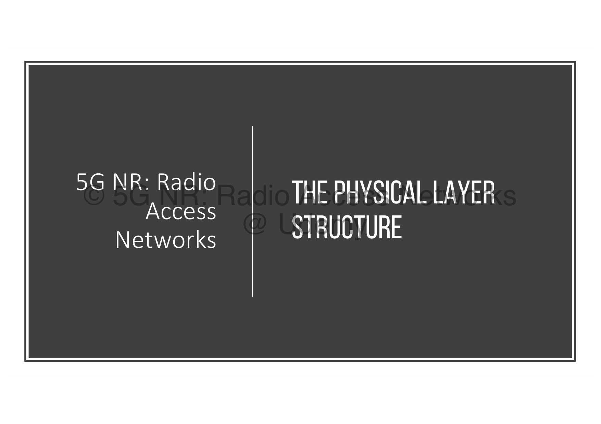
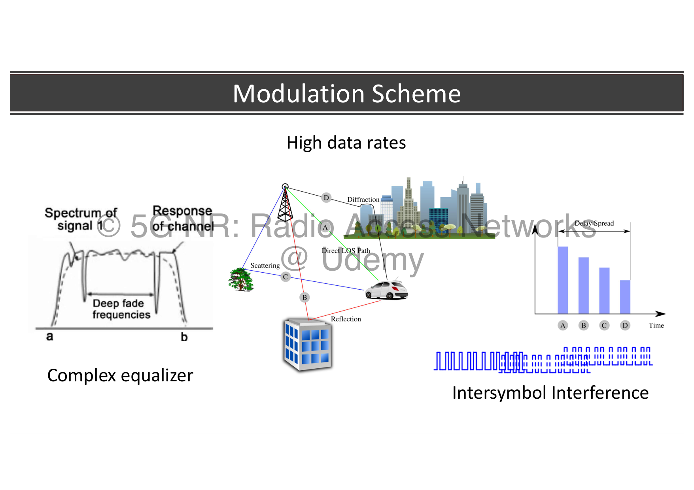
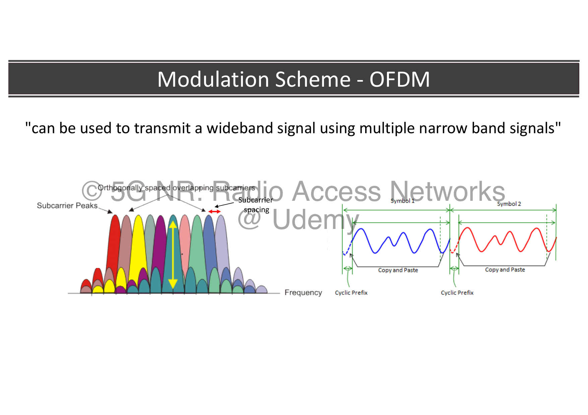
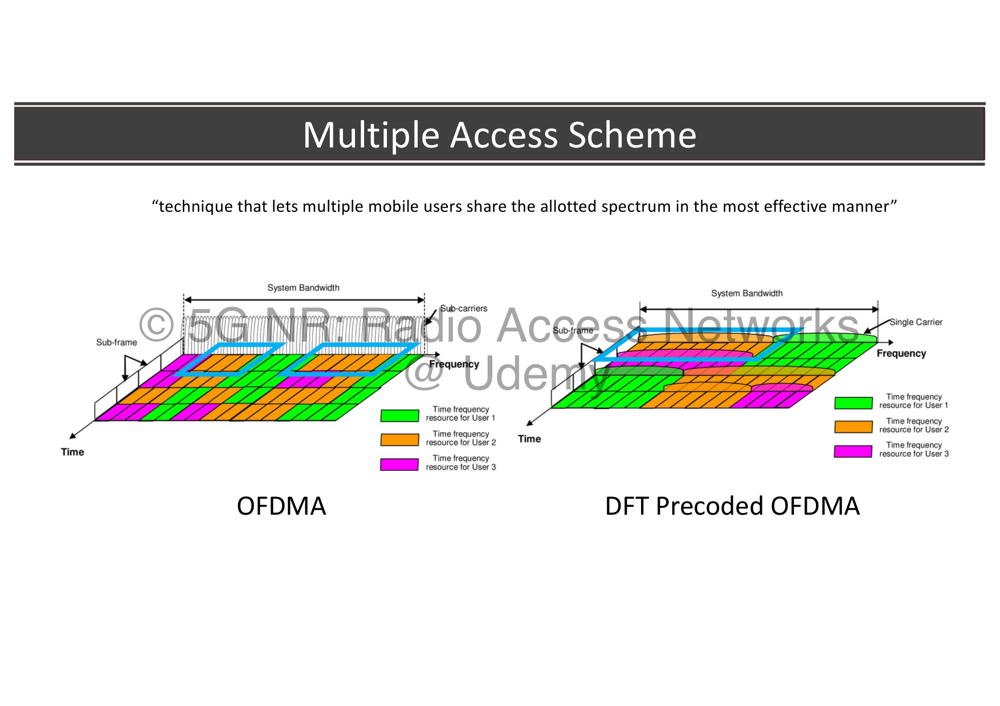
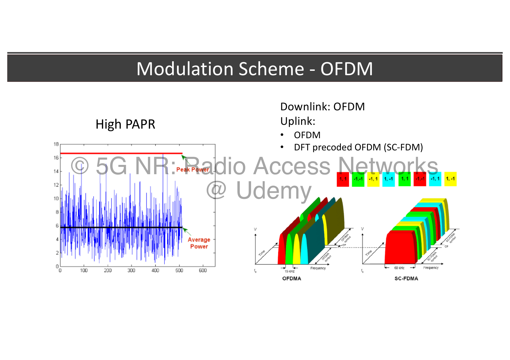
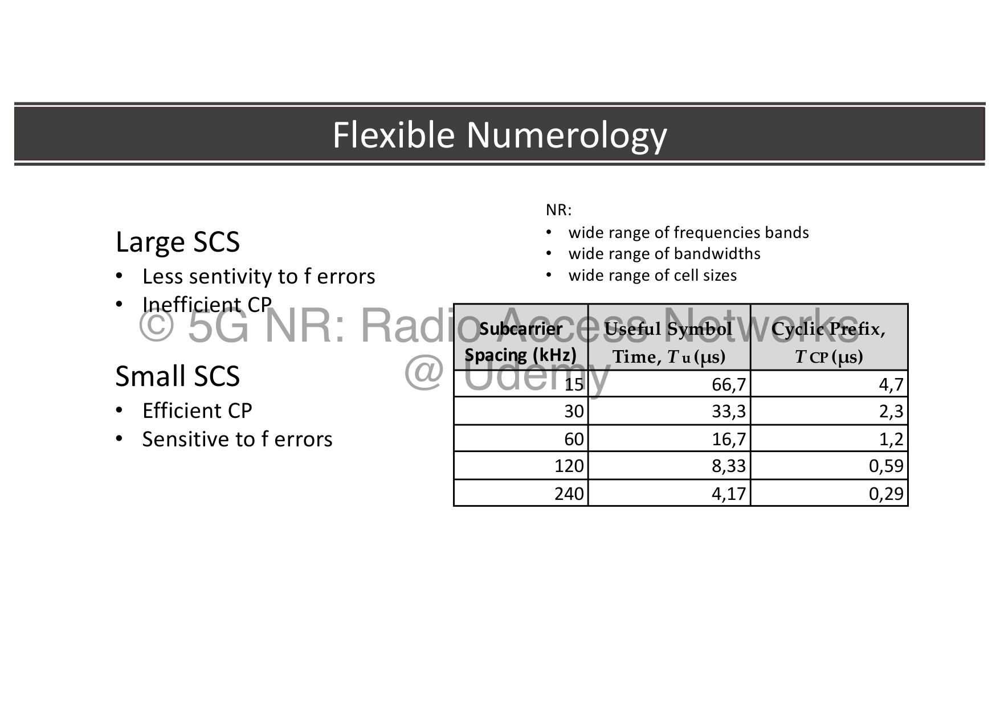
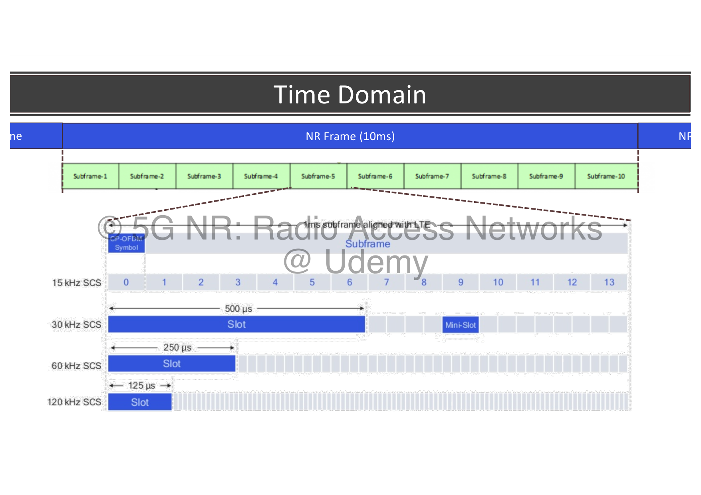
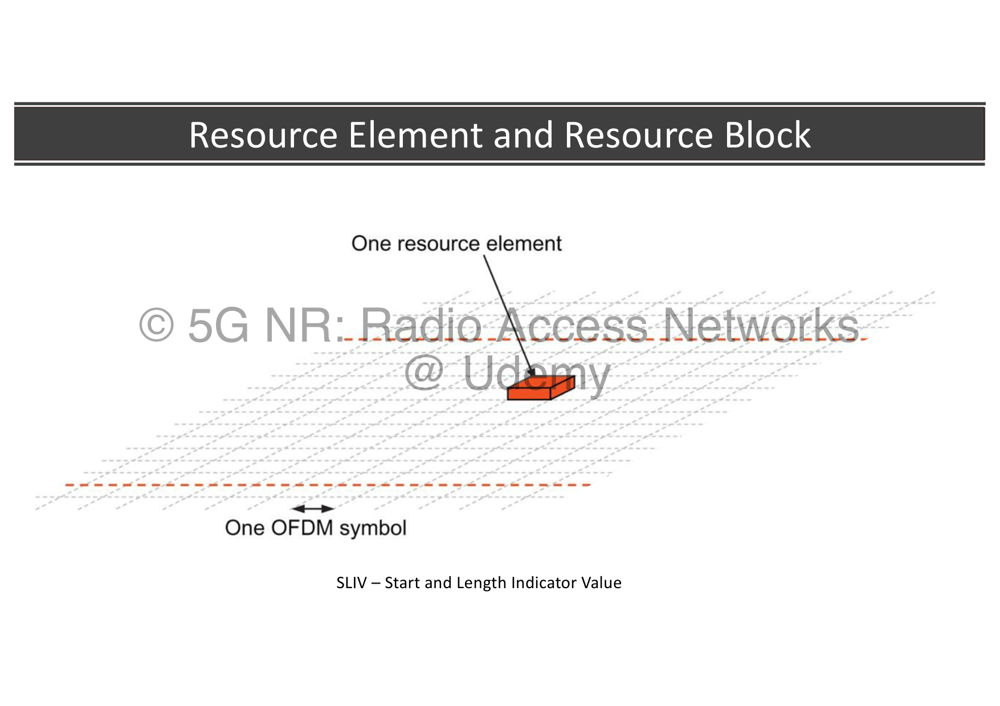
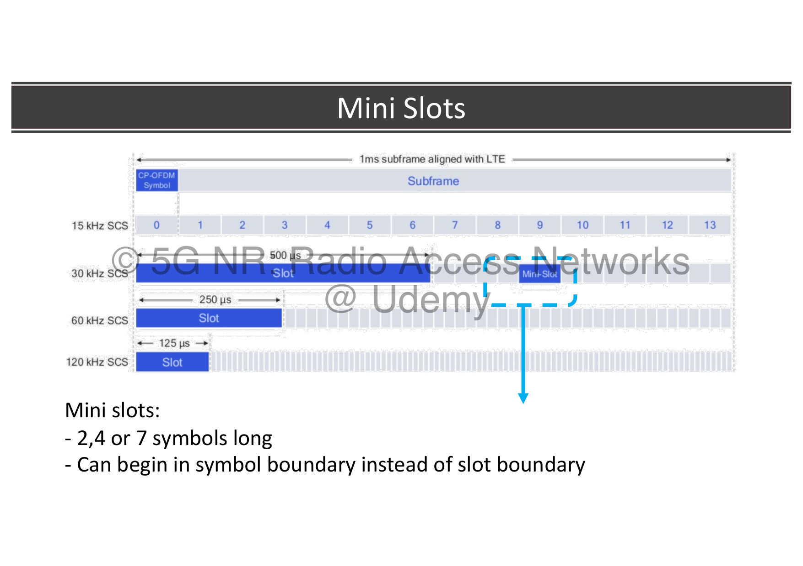
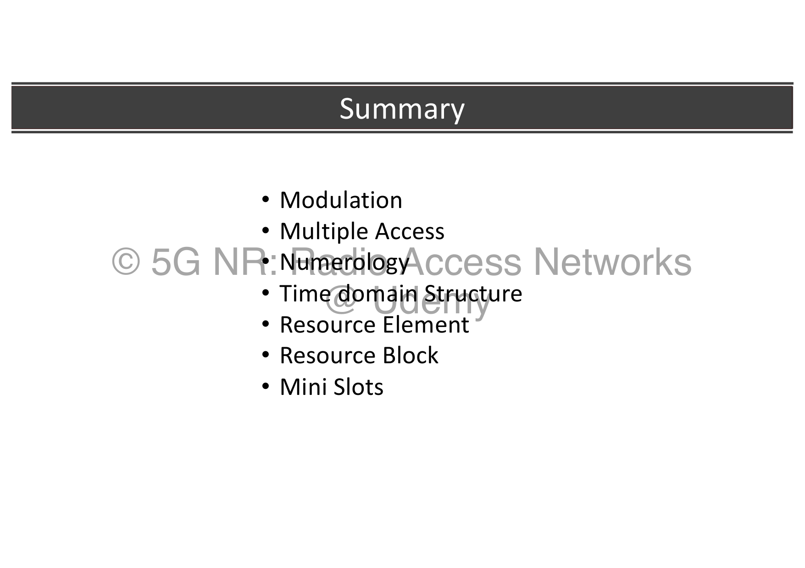

# 08. 5G Physical Layer Structure and Numerology

This chapter focuses on the foundational modulation schemes, multiple access choices, flexible numerology, and the precise grid boundaries that define how data is carved up in the time and frequency domains.



---

## 🌊 1. The Core Modulation Scheme: OFDM

5G NR utilizes **OFDM (Orthogonal Frequency Division Multiplexing)** as its foundational modulation scheme.

### The Problem with Wideband Channels:
When data is transmitted at extremely high rates over a single wideband channel, the duration of each individual symbol becomes incredibly short. If a symbol is too short, it becomes highly vulnerable to **Intersymbol Interference (ISI)** caused by multi-path propagation (echoes of the radio wave bouncing off buildings, trees, and terrain, and arriving at slightly different times). To fix ISI in traditional single-carrier systems, a highly complex and power-hungry equalizer is required at the receiver.



### The OFDM Solution:
OFDM solves this by splitting a single wideband signal into **multiple parallel, orthogonal narrowband subcarriers**.



* Instead of blasting data sequentially at high speeds over one big pipe, OFDM divides the data stream and transmits it slowly across dozens of tightly packed, non-interfering subcarriers simultaneously.
* Because each subcarrier operates at a lower speed, the individual symbol duration becomes much longer, making the signal naturally resilient to multi-path interference.
* **Cyclic Prefix (CP):** To completely eliminate any residual ISI, a **Cyclic Prefix (CP)** is added as a guard interval. The transmitter copies a small slice from the *end* of an OFDM symbol and prepends it to the *front* of the symbol. If multi-path reflections arrive within this guard window, they overlap with the copied prefix rather than corrupting the adjacent symbol.

---

## 🚦 2. Multiple Access Schemes & The PAPR Trade-off

While OFDM is great for organizing data, the network must also manage how multiple mobile users share the allotted spectrum effectively (**Multiple Access Scheme**). 5G NR splits this strategy between the Downlink and the Uplink:



### Downlink (Tower ➔ Phone): CP-OFDM / OFDMA
* **The Choice:** Downlink always uses standard **OFDMA** (Orthogonal Frequency Division Multiple Access).
* **The Setup:** The base station dynamically divides subcarriers among different users based on their immediate traffic demands.

### Uplink (Phone ➔ Tower): The Dual-Option Flexibility
Unlike the downlink, the uplink gives the network the flexibility to choose between two schemes depending on what the phone needs most:



1. **CP-OFDM (Standard OFDMA):** Used when the phone has a clean, strong connection and requires maximum data throughput. It supports advanced multi-antenna spatial processing (MIMO) smoothly.
2. **DFT-precoded OFDM (SC-FDMA):** Used primarily when a phone is at the edge of a cell tower's coverage area or needs to save battery power.

#### The PAPR Engineering Constraint
The reason 5G leaves **DFT-precoded OFDM** as an option for the uplink comes down to **PAPR (Peak-to-Average Power Ratio)**:
* Standard OFDM combines hundreds of independent subcarriers mathematically. Sometimes, their waveforms line up perfectly, creating massive instantaneous power peaks (**High PAPR**). To avoid distorting this peak signal, the phone's power amplifier must operate at a lower average power level, reducing its effective range.
* **DFT-precoding** mathematically processes the symbols before passing them to the OFDM grid, giving the transmission a "single-carrier" property. This significantly **lowers the PAPR**. Because the power variations are smaller, the phone's power amplifier can operate near its saturation limit, raising the average transmission power safely. This extends its coverage reach to hit distant towers without killing its battery.

---

## 🧬 3. Flexible Numerology & Subcarrier Spacing (SCS)

In 4G LTE, the distance between subcarriers was rigidly locked at a single value: 15 kHz. 5G NR breaks this limitation by introducing **Flexible Numerology**, allowing the network to scale its subcarrier spacing based on the environment.

The numerology is governed by an exponential parameter $\mu$ (where $\text{SCS} = 15 \times 2^\mu \text{ kHz}$):



| Numerology Index ($\mu$) | Subcarrier Spacing (SCS) | Useful Symbol Time ($T_u$) | Cyclic Prefix ($T_{CP}$) | Primary Deployment Spectrum |
| :--- | :--- | :--- | :--- | :--- |
| **$\mu = 0$** | **15 kHz** | 66.7 $\mu$s | 4.7 $\mu$s | Sub-3 GHz (Legacy cellular bands) |
| **$\mu = 1$** | **30 kHz** | 33.3 $\mu$s | 2.3 $\mu$s | Mid-Band / Sub-6 GHz (The main 5G capacity layer) |
| **$\mu = 2$** | **60 kHz** | 16.7 $\mu$s | 1.2 $\mu$s | High Mid-Band / Sub-6 Dense Urban |
| **$\mu = 3$** | **120 kHz** | 8.33 $\mu$s | 0.59 $\mu$s | Millimeter Wave (mmWave high-frequency bands) |
| **$\mu = 4$** | **240 kHz** | 4.17 $\mu$s | 0.29 $\mu$s | mmWave Beam Management / Special Channels |

### The Engineering Trade-offs:
* **Large Subcarrier Spacing (e.g., 120 kHz):** Yields an incredibly short symbol time, which drastically reduces latency. It also provides **less sensitivity to phase noise and frequency errors** (Doppler spread), which is a major technical issue at high millimeter-wave frequencies. The downside is that the **Cyclic Prefix (CP) becomes very short**, giving the signal less protection against multi-path echoes.
* **Small Subcarrier Spacing (e.g., 15 kHz):** Provides a long symbol time and a **highly efficient, long Cyclic Prefix** that can easily survive the multi-path reflections found in wide rural areas. However, it is **highly sensitive to frequency errors** and phase jitter.

By allowing these parameters to scale, a single 5G standard can seamlessly adapt to accommodate a wide range of frequency bands, diverse system bandwidths, and wildly varying cell coverage sizes.

---

## 🧱 4. The Time Domain Grid Structure

Time in the 5G NR physical layer is organized into a nested hierarchy:



* **NR Frame (10 ms):** The absolute master baseline unit of time. Every radio frame is exactly 10 milliseconds long.
* **Subframe (1 ms):** Every frame is divided into exactly **10 subframes** of equal 1-millisecond duration, regardless of the numerology being used. This acts as a fixed time reference.
* **Slots (The Scalable Scheduling Unit):** This is where flexible numerology changes the grid layout. A single slot always contains exactly **14 OFDM symbols**. However, as the subcarrier spacing doubles, the symbol duration shrinks by half, packing more slots into each 1-millisecond subframe:
  * For **15 kHz ($\mu=0$):** 1 slot per subframe (14 symbols total per ms).
  * For **30 kHz ($\mu=1$):** 2 slots per subframe (28 symbols total per ms).
  * For **60 kHz ($\mu=2$):** 4 slots per subframe (56 symbols total per ms).
  * For **120 kHz ($\mu=3$):** 8 slots per subframe (112 symbols total per ms).

---

## 🧮 5. Resource Elements (RE) and Resource Blocks (RB)

When the MAC scheduler maps data onto physical hardware, it uses explicit atomic coordinates within the time-frequency resource grid:



```text
       ▲ Frequency
       │
       ├─┬─┬─┬─┬─┬─┬─┬─┬─┬─┬─┬─┬─┬─┤
       │ │ │ │ │ │ │ │ │ │ │ │ │ │ │  <- 1 Resource Block (RB)
       ├─┼─┼─┼─┼─┼─┼─┼─┼─┼─┼─┼─┼─┼─┤     = 12 Subcarriers wide
       │ │ │ │ │ │ │ │ │ │ │ │ │ │ │
       ├─┼─┼─┼─┼─┼─┼─┼─┼─┼─┼─┼─┼─┼─┤
       │ │ │▓│ │ │ │ │ │ │ │ │ │ │ │  <- 1 Resource Element (RE)
       ├─┴─┴─┴─┴─┴─┴─┴─┴─┴─┴─┴─┴─┴─┤     = 1 Subcarrier × 1 OFDM Symbol
       │                           │
       └───────────────────────────┴─► Time
         ◄────── 14 Symbols ──────►
               (1 Slot)
```

* **Resource Element (RE):** The absolute smallest physical unit of the grid. It consists of exactly **one single subcarrier in frequency and one single OFDM symbol in time**. A single RE carries your modulated data bits (e.g., 8 bits if using 256QAM).
* **Resource Block (RB):** The baseline currency used for scheduling allocations. In 5G NR, a Resource Block is defined strictly as **12 continuous subcarriers in the frequency domain** (unlike 4G LTE, which defined it as 12 subcarriers wide and 1 slot long).

### ⏱️ Flexible Allocation: The SLIV Principle
Unlike older systems that forced allocations to match rigid slot boundaries, 5G NR allows the network to schedule data bursts that start and stop mid-slot. This is controlled by the **SLIV (Start and Length Indicator Value)** parameter.

The SLIV parameter dynamically packs two commands into a single value: the exact **Starting symbol index** within the slot ($0 \le S \le 13$), and the total **Length of continuous symbols** assigned for the transmission ($1 \le L \le 14$). This allows the MAC scheduler to precisely clip data allocations down to micro-slots, helping the network achieve ultra-low latencies for critical traffic.

---

## ⏱️ 6. Mini-Slot Scheduling
In addition to standard slot scheduling (which uses 14 OFDM symbols), 5G NR introduces **Mini-slot Scheduling** to support ultra-low latency and dynamic preemption:



* **Short Allocations:** Mini-slots are configured to be **2, 4, or 7 OFDM symbols long**.
* **Flexible Start:** Unlike standard slots that must align with slot boundaries, a mini-slot can **begin at any arbitrary symbol boundary** within a slot.
* **Primary Applications:** 
  * Instantly transmitting urgent **URLLC** safety-critical packets without waiting for slot boundaries (leveraging downlink preemption).
  * Supporting short transmissions in high millimeter-wave spectrum (FR2) where beam sweeping changes rapidly.

---

## 📊 Summary of Physical Layer Structure

The 5G physical structure is optimized for extreme flexibility and low latency:



* **OFDM Modulation:** Protects wideband channels against Intersymbol Interference.
* **Uplink Flexibility:** CP-OFDM (OFDMA) for high throughput vs DFT-precoded OFDM (SC-FDMA) to lower PAPR and extend cell coverage at cell edges.
* **Flexible Numerology ($\mu$):** Scales subcarrier spacing (15, 30, 60, 120, 240 kHz) to match spectrum and coverage needs.
* **Resource Grid Units:** Resource Elements (RE), Resource Blocks (12 subcarriers wide), and SLIV parameters.
* **Mini-slots:** Allocates 2, 4, or 7 symbol transmissions starting at any symbol boundary to minimize system latency.


---
## 🔗 Related Notes
* **Previous Topic:** [[07. 5G Physical Layer (PHY) Processing and Channels|07. 5G Physical Layer (PHY) Processing and Channels]]
* **Next Topic:** [[09. 5G RRC and NAS States and Mobility|09. 5G RRC and NAS States and Mobility]]
* **Module Index:** [[5G New Radio (NR) Radio Access Network - Index|Back to 📡 Module 2 Index]]
