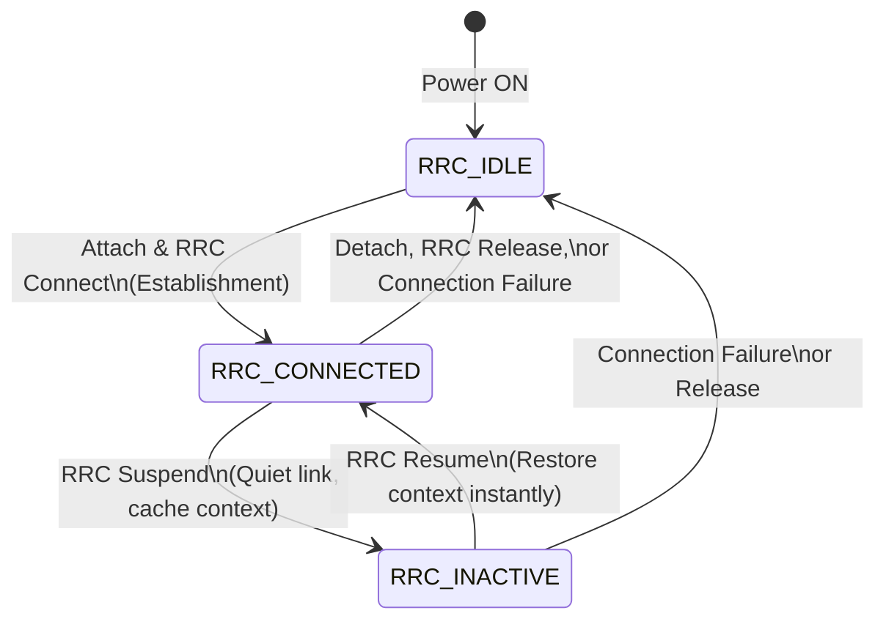

# 09. 5G RRC and NAS States and Mobility

In the 5G System architecture, the Control Plane is completely isolated from the User Plane to separate network signaling commands from actual user data. The heavy lifting of Layer 3 control plane signaling is split between two distinct protocol entities: **RRC (Radio Resource Control)** which manages the wireless radio link access, and **NAS (Non-Access Stratum)** which connects the phone straight to the core network brain.

![[RRC_Slide_1.png]]

---

## 📡 1. Architectural Division: RRC (Access Stratum) vs. NAS (Non-Access Stratum)

The control plane is split cleanly into two domains to decouple local radio link management from global session and mobility registration:

![[RRC_Slide_2.png]]

### A. RRC (Radio Resource Control) — The Radio Domain
RRC belongs strictly to the **Access Stratum (AS)**. It terminates directly between the **User Equipment (UE)** and the **gNodeB base station** (RAN). The gNodeB intercepts, decodes, and acts upon every single RRC message.

#### Core Mandates of the RRC Layer:
* **System Information Broadcasts:** The gNodeB constantly broadcasts essential system parameters—via the Master Information Block (MIB) and System Information Blocks (SIBs)—allowing any local smartphone to discover the Cell ID, synchronize timing boundaries, and learn local network access rules.
* **Paging:** When downlinking traffic to an idle device, RRC coordinates localized paging broadcasts across the radio cells to alert the phone to wake up and connect.
* **Connection Management:** Explicitly controls the end-to-end setup, modification, and tearing down of active Signalling Radio Bearers (SRBs) and Data Radio Bearers (DRBs) over the air.
* **Measurement Configuration & Reporting:** Commands the phone's hardware exactly when and on what frequencies to scan neighboring cell signals. The phone responds with explicit measurement reports, helping the network coordinate mobility functions.
* **Mobility Functions:** Directs handover execution routines when a phone is moving out of range, shifting connection parameters seamlessly to a new target cell.
* **Handling of Device Capabilities:** Interrogates the device to retrieve its hardware specifications, such as supported frequency bands, Carrier Aggregation pairings, and MIMO layer limits.

### B. NAS (Non-Access Stratum) — The Core Domain
NAS is the highest control protocol layer on the device. It forms an end-to-end control channel passing straight between the **UE** and the **AMF (Access and Mobility Management Function)** within the 5G Core Network.

#### The Transparent Postman Rule:
The gNodeB base station does not read, unpack, or process NAS protocol messages. It encapsulates the NAS payload cleanly inside an over-the-air RRC envelope, strips the envelope off at the base station, and forwards the raw NAS text straight across the wired N2 interface to the AMF core.

#### Core Mandates of the NAS Layer:
* **Authentication:** Orchestrates cryptographic handshakes with the Core Network's AUSF function to verify that the device’s SIM card is legitimate and allowed onto the network.
* **Security Control:** Manages the generation, distribution, and coordination of core-level encryption and integrity keys.
* **Idle-Mode Procedures:** Coordinates Registration Area updates when a sleeping phone crosses tracking boundaries, ensuring the core always knows its general whereabouts.
* **Assigning IP Addresses:** Initiates PDU Session establishment requests down to the Session Management Function (SMF) to securely provision and assign the device its IP address.

---

## 🔄 2. The 3-State RRC State Machine

In 4G LTE, a phone could only cycle between two states: IDLE or CONNECTED. 5G NR introduces a brand-new **3-State RRC State Machine** to solve power consumption and latency challenges.

---

### State 1: RRC_IDLE

![[RRC_Slide_3.png]]

* **The Setup:** The device is asleep. There is **no active connection** between the phone and the gNodeB, and no data radio bearers exist.
* **Core Context:** The core network marks the device status as **Deregistered** or detached. The 5G Core context is fully deleted, meaning the phone holds no active network tracking hooks.
* **Device Behavior:** The phone spends its time cycling through power-saving Discontinuous Reception (DRX) sleep periods, waking up briefly to listen for Paging commands or read SIB parameters.

---

### State 2: RRC_CONNECTED

![[RRC_Slide_4.png]]

* **The Setup:** The device is fully awake. A dedicated RRC connection is actively established, and Signalling and Data Radio Bearers are mapped across the airwaves.
* **Core Context:** The base station knows the device's exact location down to a specific radio cell level. The 5G Core is fully aware of the user session, actively routing data down the user-plane path.
* **Device Behavior:** The phone actively transmits and receives data payloads, performs continuous channel quality measurements, and handles fast handovers.

---

### State 3: RRC_INACTIVE (The 5G Innovation)

![[RRC_Slide_5.png]]

* **The Setup:** The radio link goes quiet, but the network holds its breath. Over-the-air radio data bearers are suspended to save power, but the device's session details are not deleted.
* **The Trick:** The gNodeB base station and the device **cache the complete connection context** (including security keys, encryption parameters, and bearer profiles) inside their local memory.
* **Core Connection Stays Alive:** From the perspective of the 5G Core Network, **the connection remains in an active state**. The Core thinks the phone is still actively connected to that gNodeB cluster (`CM-CONNECTED` at the AMF), saving the network from tearing down background core sessions.
* **Device Behavior:** The phone behaves like it is in IDLE mode, conserving battery power. However, the moment a user clicks a link, the device executes an ultra-fast **RRC Connection Resume** sequence. Because both sides already have the security context cached in memory, the connection stands up instantly **without running the heavy, slow NAS authentication loops all over again**. This minimizes startup delay and enables the near-instant wake-up response times required for 5G applications.

---

## 🏎️ 3. Mobility Management Frameworks

Mobility management in 5G NR is divided into two distinct operational paradigms based on the active state of the device:

![[RRC_Slide_6.png]]

---

### A. Idle and Inactive Mode Mobility (UE-controlled)

When the device is not actively transmitting data (i.e., in `RRC_IDLE` or `RRC_INACTIVE` states), **the UE controls the mobility** using Cell Selection and Cell Reselection algorithms based on signal thresholds.

![[RRC_Slide_7.png]]

To avoid signaling overhead while still keeping track of the UE's location for paging, the network is divided into hierarchical tracking areas:

1. **Core-level Areas (Tracking Areas - TA):**
   * **Scope:** Managed by the 5G Core (AMF). A Tracking Area is identified by a **Tracking Area Identifier (TAI)**.
   * **Active State:** Used when the UE is in **RRC_IDLE** mode.
   * **Update Trigger:** The UE is assigned a "Registration Area" consisting of one or more Tracking Areas. If the UE crosses the boundary of its assigned Tracking Areas, it must wake up and send a **NAS Registration Update / Tracking Area Update (TAU)** to the AMF.
2. **RAN-level Areas (RAN Notification Areas - RNA):**
   * **Scope:** Managed strictly by the RAN (gNodeB). A RAN Notification Area is identified by a **RAN Area Identifier (RAI)** and consists of one or more cells.
   * **Active State:** Used when the UE is in **RRC_INACTIVE** mode.
   * **Update Trigger:** UEs in `RRC_INACTIVE` can move freely within their assigned RNA without sending any uplink signaling. However, if the UE crosses the boundary of its assigned RNA, it must initiate a **RAN Notification Area Update (RNAU)** RRC procedure to inform the gNodeB. This is completely transparent to the Core Network, ensuring zero core-level signaling overhead.

---

### B. Connected Mode Mobility (Network-controlled)

When the device is actively transmitting data (i.e., in the `RRC_CONNECTED` state), **the network controls the mobility** to ensure continuous QoS.

![[RRC_Slide_8.png]]

* **SSB-driven Measurements:** The UE continuously monitors the signal strength and quality of its current **Serving cell** and surrounding **Neighboring cells** by measuring the **SS Block** (Synchronization Signal Block / SSB).
* **Measurement Configuration:** The gNodeB configures the UE via RRC signaling with measurement parameters (frequencies, timing, filter coefficients) and specific reporting thresholds (Events A1 through A6, such as Event A3: Neighbor becomes offset better than Serving).
* **Active Handover:** When a reporting threshold is met, the UE sends a Measurement Report RRC message to the serving gNodeB. The gNodeB decides to execute a handover, negotiates with the target gNodeB, and commands the UE to execute the switch via an RRC Reconfiguration message (Handover Command).

---

## 📊 Summary of Control Plane Architecture

The 5G NR Layer 3 control plane separates local, high-speed radio links from global core procedures to maximize efficiency:

![[RRC_Slide_9.png]]

* **RRC vs. NAS:** RRC terminates at the gNodeB for fast radio access control; NAS passes transparently to the AMF Core for session authorization and security.
* **3-State RRC Machine:** Introduces `RRC_INACTIVE` to suspend radio bearers while caching connection profiles locally. This allows the core network connection to stay alive, enabling instant resumed access.
* **Dual Mobility Models:**
  * **UE-Controlled:** Cell reselection based on cell metrics, mapped to core Tracking Areas (IDLE) or RAN Notification Areas (INACTIVE).
  * **Network-Controlled:** Active Handover triggered by SSB measurement reports (CONNECTED).

![[RRC_Slide_10.png]]

---
## 🔗 Related Notes
* **Previous Topic:** [[08. 5G Physical Layer Structure and Numerology|08. 5G Physical Layer Structure and Numerology]]
* **Module Index:** [[5G New Radio (NR) Radio Access Network - Index|Back to 📡 Module 2 Index]]
