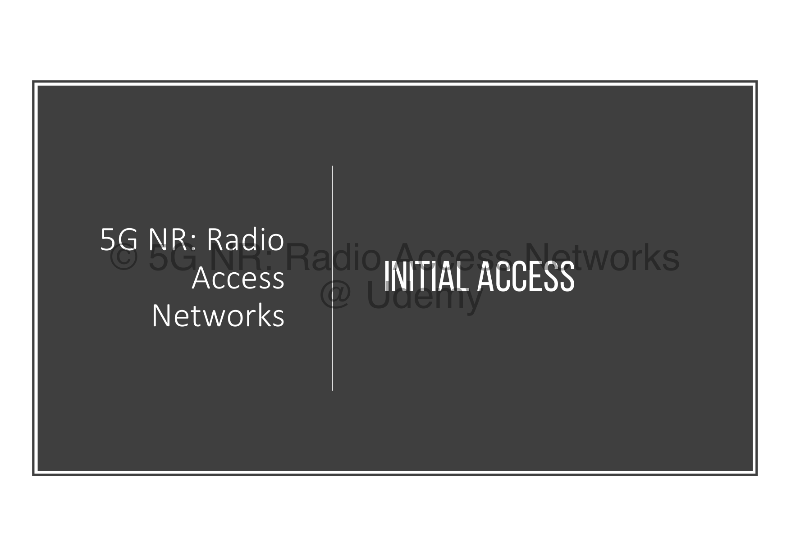
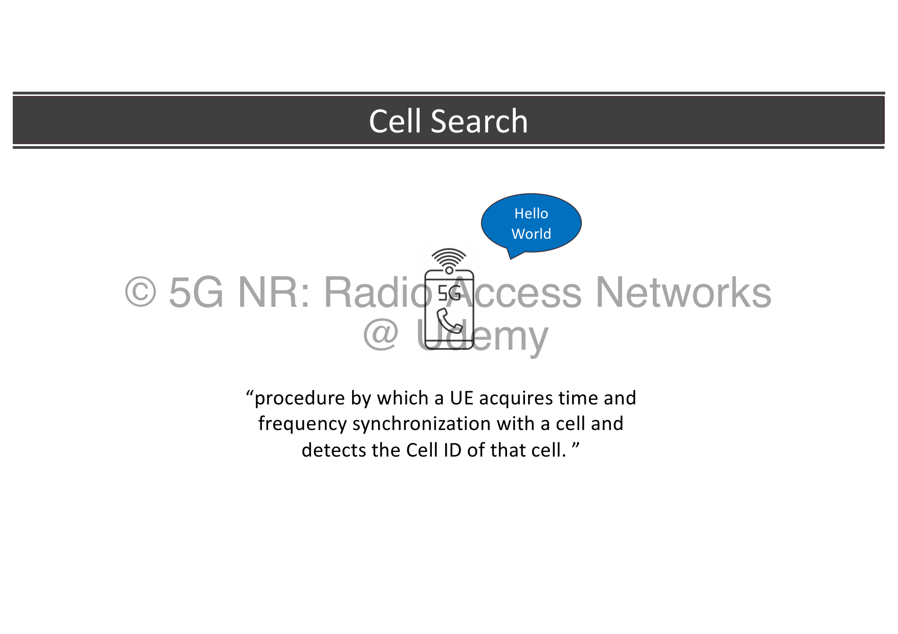
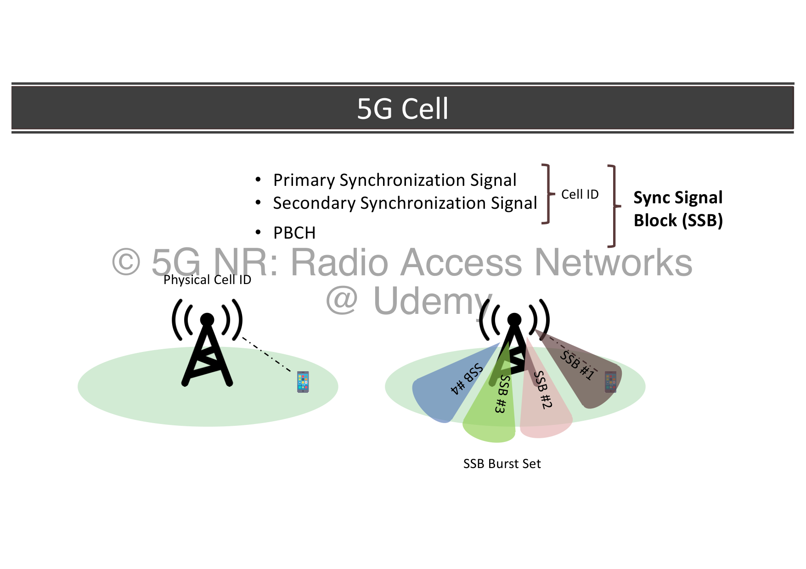
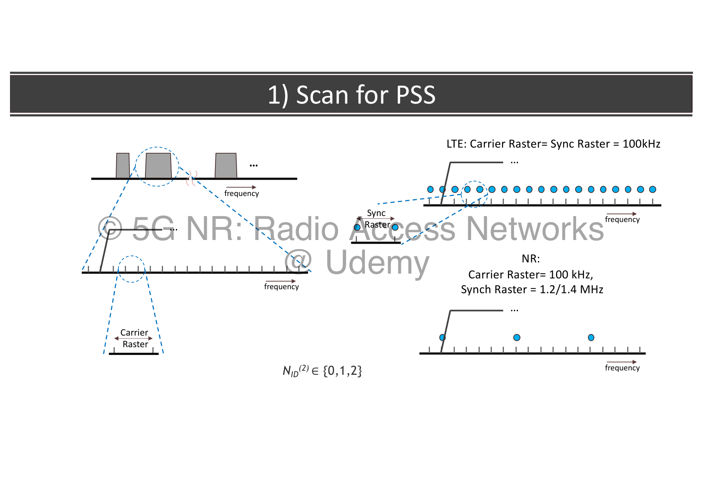
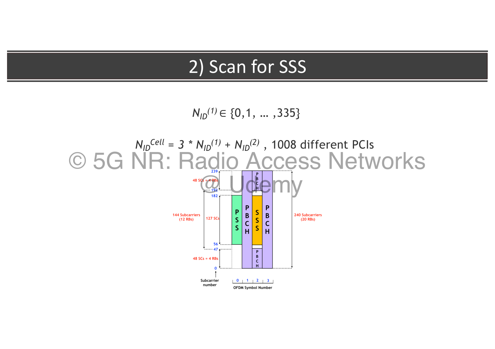
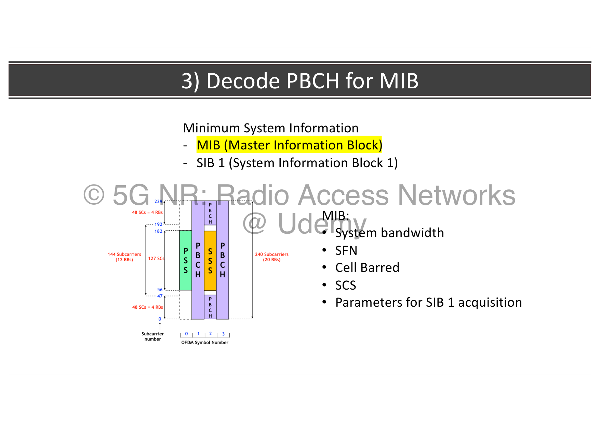
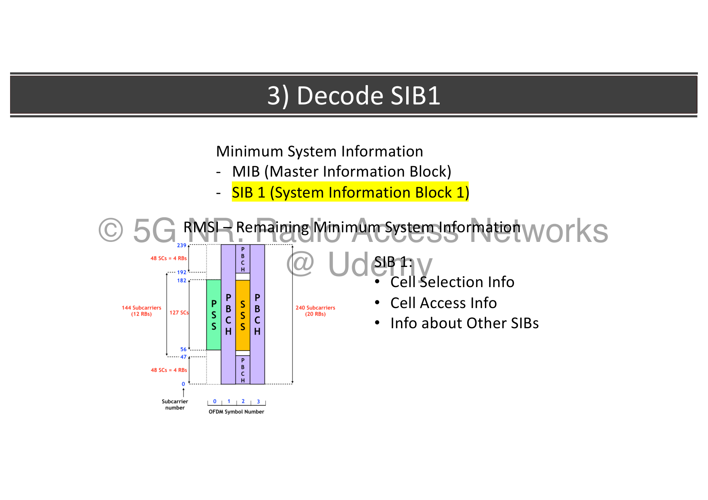
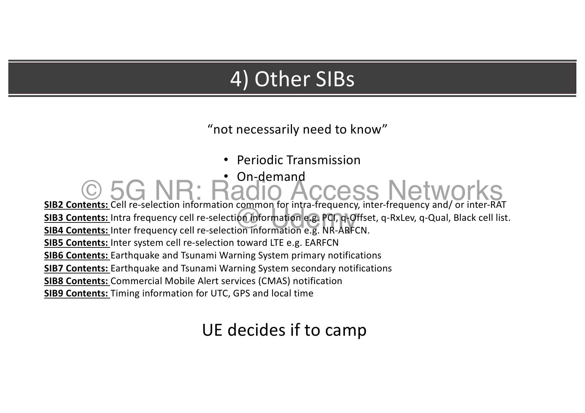
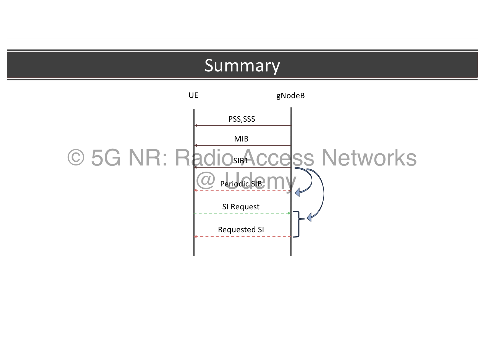
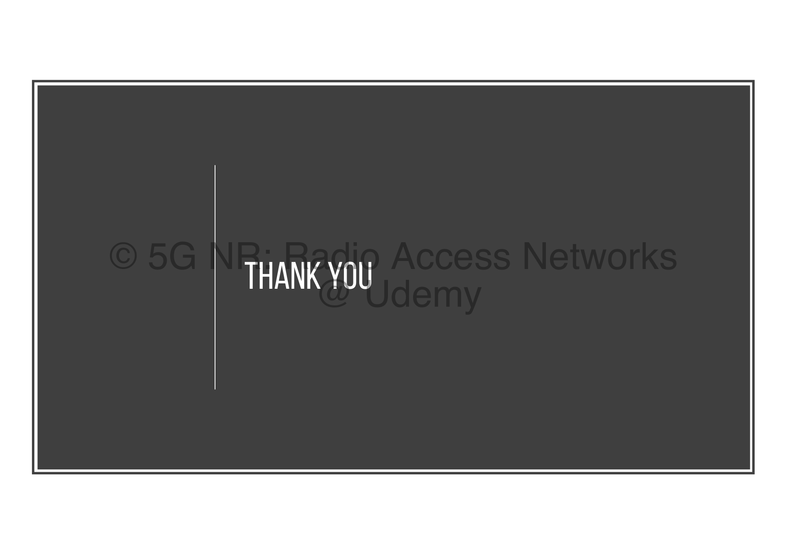

# 01. 5G Cell Search and Initial Access

Initial Access is the gateway procedure that allows a device to discover a local network, synchronize itself in time and frequency, read system-wide cell configurations, and camp on the cell. It marks the transition of a device from a disconnected state to a network-aligned state.

---

## 🔍 1. Defining Cell Search

Cell Search is the foundational procedure by which a User Equipment (UE) acquires time and frequency synchronization with a cell and detects the Physical Cell Identity (PCI) of that cell.

Without synchronization, the UE cannot decode any control signals or data symbols sent by the base station. The cell search procedure must be executed:
* Upon initial power-on of the device.
* When recovering from a lost connection (out-of-sync state).
* Continuously in the background to scan for neighboring cells to support handovers in connected mode.

---

## 🧱 2. Physical Cell ID (PCI) and the SSB Structure

5G NR organizes synchronization signals into a single, tightly packed physical block called the **Synchronization Signal Block (SSB)**, also known as the **SS/PBCH Block**.

### The SSB Components:
A single SSB is 4 OFDM symbols long in the time domain and spans 240 subcarriers (20 Resource Blocks) in the frequency domain. It packs three distinct physical structures:
1. **Primary Synchronization Signal (PSS):** Occupies the first symbol. Used for initial timing alignment and frequency synchronization.
2. **Secondary Synchronization Signal (SSS):** Occupies the third symbol. Used to determine the cell identity group and complete synchronization.
3. **Physical Broadcast Channel (PBCH):** Occupies the remaining space. It carries the Master Information Block (MIB) containing crucial initial configurations.

### Physical Cell Identity (PCI) Formula:
The Physical Cell ID (PCI) uniquely identifies a cell at the physical layer. In 5G NR, there are **1008 different PCIs** (double the 504 PCIs available in 4G LTE). The PCI is calculated mathematically using two indexes:
* $N_{\text{ID}}^{(2)} \in \{0, 1, 2\}$: The physical-layer identity within a group, derived directly from the **PSS**.
* $N_{\text{ID}}^{(1)} \in \{0, 1, \dots, 335\}$: The physical-layer cell-identity group, derived directly from the **SSS**.

The Physical Cell Identity is defined as:
$$N_{\text{ID}}^{\text{cell}} = 3 \times N_{\text{ID}}^{(1)} + N_{\text{ID}}^{(2)}$$

### SSB Burst Set:
To support directional beamforming, a gNodeB transmits multiple SSBs in different spatial directions over a short window (typically 5 ms). This is called an **SSB Burst Set**. Each SSB (e.g., SSB #1, SSB #2, SSB #3, SSB #4) is swept in a specific direction, allowing a device in any sector of the cell to pick up the synchronization signals.

---

## 📻 3. Step 1: Scan for PSS & The Sparse Synchronization Raster

When a device powers on, it starts by scanning the radio frequencies for the **Primary Synchronization Signal (PSS)**.

### Carrier Raster vs. Synchronization Raster:
To discover the PSS in older networks like 4G LTE, the UE had to scan every 100 kHz carrier step across the entire band. For wide 5G channels, this legacy scanning strategy would take too long and drain the device's battery immediately.

5G NR solves this by separating the data channel grid from the synchronization grid:
* **Carrier Raster (100 kHz):** The fine-grained frequency grid used to schedule user data and physical channels.
* **Synchronization Raster (1.2 / 1.4 MHz):** A sparse, widely spaced frequency grid defined by the **Global Synchronization Channel Number (GSCN)**. The gNodeB is strictly forced to transmit the SSB *only* on specific channels aligned with the Synchronization Raster.

During initial cell search, the UE does not scan the fine Carrier Raster. Instead, it runs a fast scan along the sparse **Synchronization Raster**, instantly finding the PSS and decoding the first part of the cell identity, $N_{\text{ID}}^{(2)} \in \{0, 1, 2\}$.

---

## 🧬 4. Step 2: Scan for SSS & PCI Calculation

Once the PSS is found and the timing boundary of the symbol is locked, the UE scans for the **Secondary Synchronization Signal (SSS)** on the same frequency channel.

By correlation with the SSS waveform, the UE extracts the cell-identity group parameter:
$$N_{\text{ID}}^{(1)} \in \{0, 1, \dots, 335\}$$

Using the mathematical formula $N_{\text{ID}}^{\text{cell}} = 3 \times N_{\text{ID}}^{(1)} + N_{\text{ID}}^{(2)}$, the UE calculates the **PCI**. This PCI defines the exact scrambled coding sequences used for subsequent channels and references in that cell.

---

## 📖 5. Step 3: Decode PBCH for the Master Information Block (MIB)

With time-frequency synchronization established and the PCI identified, the UE decodes the **Physical Broadcast Channel (PBCH)** located inside the SSB. The PBCH carries the **Master Information Block (MIB)**, which represents the first part of the **Minimum System Information (MSI)**.

### The MIB Contents:
The MIB is broadcast periodically and contains the bare-minimum parameters a UE needs to proceed further:
* **System Bandwidth:** The frequency width of the primary carrier.
* **System Frame Number (SFN):** The master radio clock timing of the cell.
* **Cell Barred Flag:** Informs the UE if the cell is blocked for public access or reserved for emergency/maintenance.
* **Subcarrier Spacing (SCS):** The numerology ($\mu$) used for control channels.
* **Parameters for SIB1 Acquisition:** Critical parameters specifying the exact frequency location and scheduling configuration of **CORESET 0 (Control Resource Set Zero)** and the Search Space where SIB1 is transmitted.

---

## 📑 6. Step 4: Decode SIB1 (RMSI)

Using the scheduling parameters and CORESET 0 details decoded from the MIB, the UE tunes its receiver to read **System Information Block 1 (SIB1)**, which is transmitted on the Physical Downlink Shared Channel (PDSCH).

SIB1 is also known as the **Remaining Minimum System Information (RMSI)**. Together, the MIB and SIB1 make up the **Minimum System Information (MSI)**, which is mandatory for a UE to camp on any 5G cell.

### The SIB1 Contents:
* **Cell Selection Info:** Defines the minimum signal strength threshold ($Q_{\text{rxlevmin}}$) the UE must measure to be allowed to stay in this cell.
* **Cell Access Info:** Carries the PLMN Identity (operator code), Tracking Area Code (TAC), and Cell Identity.
* **Info about Other SIBs:** Serves as a directory mapping all subsequent System Information Blocks (SIB2 through SIB9), detailing whether they are broadcast periodically or must be requested on-demand by the UE.

---

## 🗃️ 7. Step 5: Other SIBs Inventory (SIB2 to SIB9)

Once the UE has parsed the Minimum System Information (MIB and SIB1), it decides whether it is permitted to camp on the cell. To operate efficiently, the UE acquires other specialized SIBs based on its immediate needs.

### The Other SIBs Catalog:
* **SIB2:** Contains cell re-selection parameters common for intra-frequency, inter-frequency, and/or inter-RAT networks.
* **SIB3:** Contains intra-frequency cell re-selection parameters (e.g., PCI list, cell-specific offsets $Q_{\text{offset}}$, blacklisted cells).
* **SIB4:** Contains inter-frequency cell re-selection parameters (e.g., NR-ARFCN grids of neighboring carriers).
* **SIB5:** Contains inter-system cell re-selection parameters targeting LTE carriers (EARFCN).
* **SIB6:** Carries Earthquake and Tsunami Warning System (ETWS) primary notifications.
* **SIB7:** Carries ETWS secondary notifications.
* **SIB8:** Carries Commercial Mobile Alert Services (CMAS) notifications.
* **SIB9:** Carries GPS, UTC, and local timing synchronization data.

---

### SIB Delivery: Periodic vs. On-Demand Transmission

To preserve precious radio spectrum, 5G NR does not force cells to constantly broadcast all SIBs at all times:

* **Periodic Transmission:** Crucial SIBs (like SIB2 and SIB3) are broadcast periodically by the cell at set intervals.
* **On-Demand Transmission:** Highly specialized SIBs (like ETWS or CMAS warnings, or GPS timing SIB9) are kept dormant. If a camped UE requires one of these dormant SIBs, it sends an uplink **SI Request** message to the gNodeB. The gNodeB then temporarily broadcasts the requested SIB (`Requested SI`). This on-demand system dramatically saves base station transmission power and spectral overhead when no UEs need specialized parameters.

---

## 📊 Summary of Initial Access

The entire Cell Search and Initial Access pipeline flows in a structured sequence, shifting from physical synchronization to logical camping:

1. **PSS/SSS Scan:** Acquired along the sparse **Sync Raster** (Sync Raster step size is 1.2/1.4 MHz, while Carrier Raster is 100 kHz). Solves symbol timing and calculates the **PCI** ($N_{\text{ID}}^{\text{cell}} = 3 \times N_{\text{ID}}^{(1)} + N_{\text{ID}}^{(2)}$).
2. **MIB Acquisition:** Decodes the PBCH inside the SSB to retrieve CORESET 0 parameters.
3. **SIB1 (RMSI) Acquisition:** Decodes the PDSCH using CORESET 0 parameters to retrieve cell selection thresholds ($Q_{\text{rxlevmin}}$) and PLMN IDs.
4. **Camping Decision:** UE validates thresholds and camps.
5. **Other SIBs Acquisition:** Decodes additional cell parameters periodically or triggers an **SI Request** for on-demand SIBs.

---
## 🔗 Related Notes
* **Next Topic:** [[02. 5G Random Access (RACH) Procedure|02. 5G Random Access (RACH) Procedure]]
* **Module Index:** [[Key RAN Procedures - Index|Back to 🔄 Module 3 Index]]
