# 02. 5G Service-Based Architecture (SBA)

The 5G Core (5GC) introduces a fundamental paradigm shift in mobile network architecture by replacing legacy monolithic network nodes with a cloud-native **Service-Based Architecture (SBA)**.

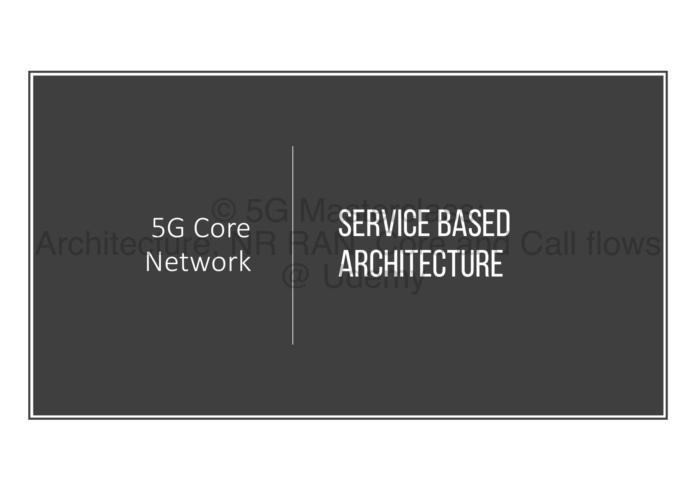

---

## 🛠️ 1. The Microservices Paradigm Shift

Under legacy architectures, mobile core networks were structured as fixed, monolithic nodes.

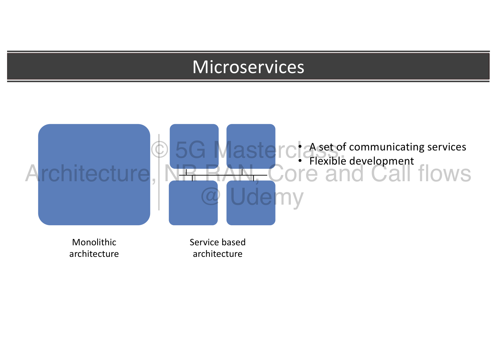

### Legacy Monolithic Architecture:
* Software functions and hardware were tightly coupled.
* Scaling or upgrading a single control plane task required modifying or rebuilding the entire node, leading to slow feature deployment and vendor lock-in.

### Service-Based Architecture (SBA):
* Decouples application logic into a set of communicating, state-free microservices called **Network Functions (NFs)**.
* Each NF performs a specialized task and can be deployed, scaled, and upgraded independently inside cloud containers (Docker/Kubernetes). This provides unprecedented system flexibility.

---

## 🗺️ 2. Architectural Representation: Reference Point vs. SBA

3GPP represents the 5G Core architecture using two distinct models:

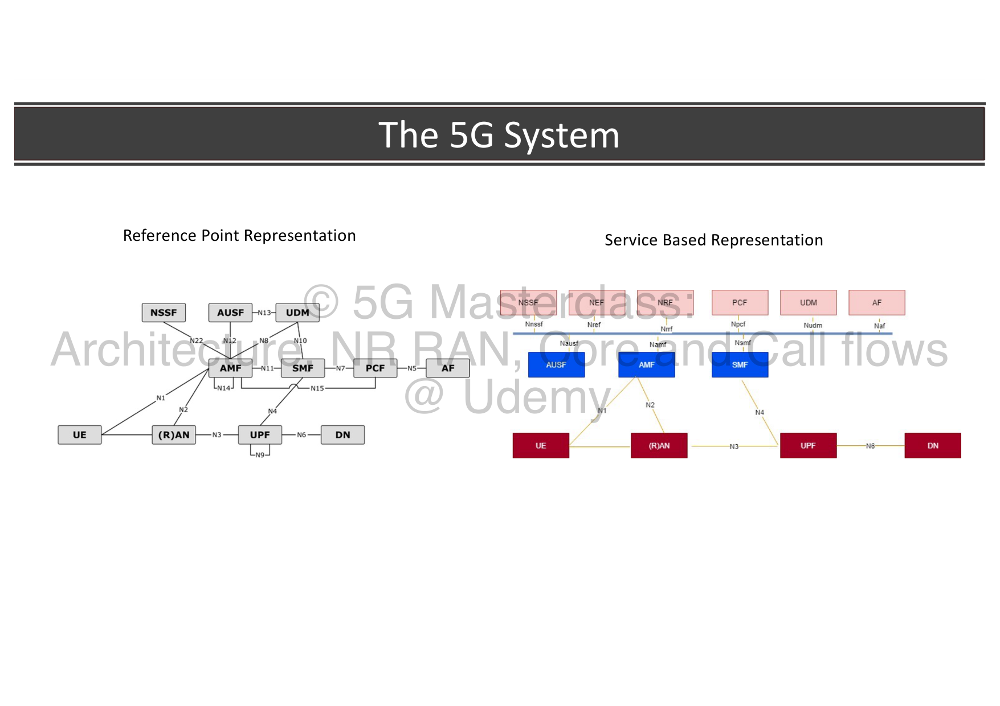

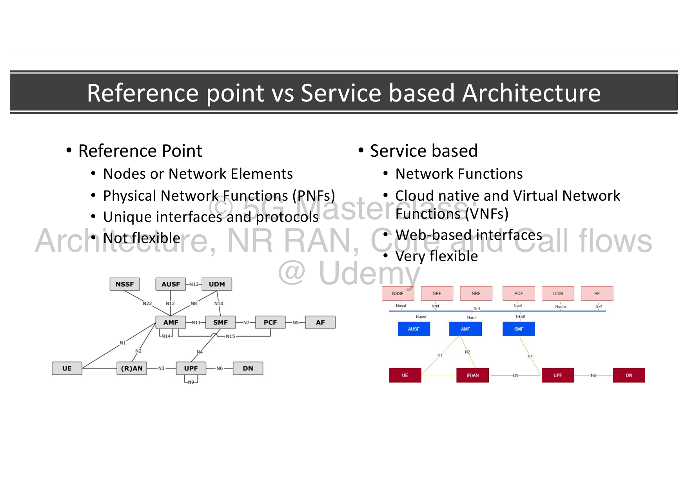

### A. Reference Point Representation
Maps explicit point-to-point interfaces connecting specific network elements using unique, dedicated protocols:
* **N1:** NAS control interface between the UE and the AMF.
* **N2:** RAN-to-AMF control interface (NG-AP protocol).
* **N3:** RAN-to-UPF user-plane interface carrying GTP-U tunnels.
* **N4:** SMF-to-UPF control interface carrying the PFCP protocol.
* **N6:** UPF-to-external Data Network (DN) user-plane interface.
* **N9:** UPF-to-UPF user-plane tunnel for anchor routing.
* **N11:** AMF-to-SMF session management interface.
* **N10:** SMF-to-UDM interface.
* **N7:** SMF-to-PCF policy interface.
* **N15:** AMF-to-PCF policy interface.
* **N12:** AMF-to-AUSF authentication interface.
* **N13:** AUSF-to-UDM credentials interface.

---

### B. Service-Based Representation
* **Concept:** Mapped as a unified bus where all Network Functions connect to a shared signaling plane.
* **Nodes:** Structured around Virtual/Containerized Network Functions (VNFs/CNFs) running on cloud infrastructure.
* **Interfaces:** Uses web-standard, uniform interfaces (`Namf`, `Nsmf`, `Npcf`, etc.) exposed over a common bus.
* **Benefit:** Extremely flexible. A new NF can simply plug into the common bus and access all registered services instantly.

---

## 🧬 3. What is a Network Function?

A **Network Function (NF)** is a functional entity within the 5G Core that exposes one or more distinct services to other network entities.

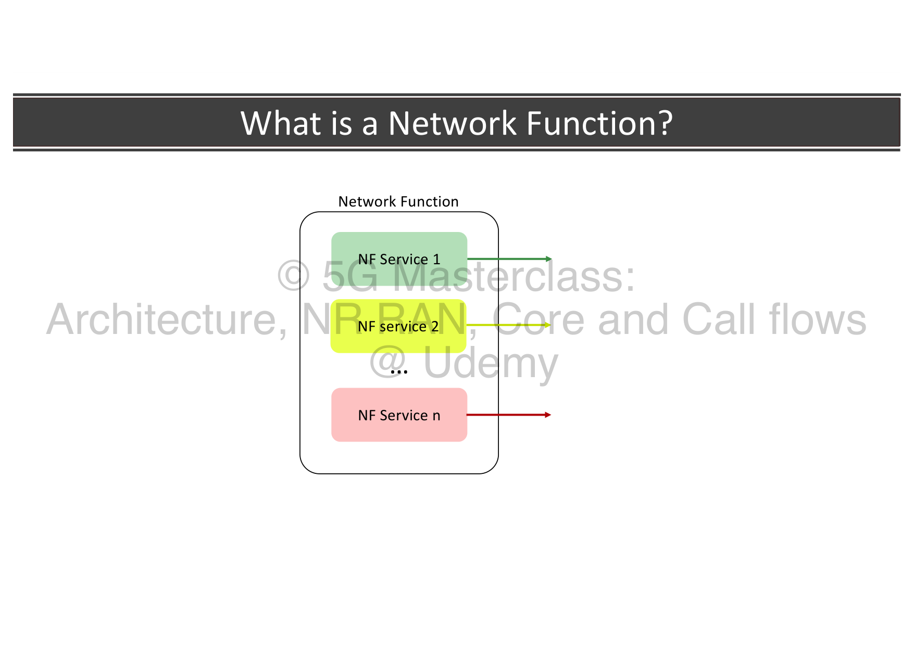

* **NF Service:** A self-contained capability exposed by an NF producer (e.g., PCF offering policy generation) over a standardized interface.
* **State-Free Design:** To enable rapid cloud scaling, 5G NFs are designed to be stateless. They separate application logic from data storage, saving all subscriber states in a unified database layer.

---

## 🌐 4. Service-Based Interface Protocols & HTTP/2 Benefits

To achieve true cloud flexibility, the 5G Core abandons legacy telecom signaling protocols (such as SS7/Diameter) in favor of modern web standards:

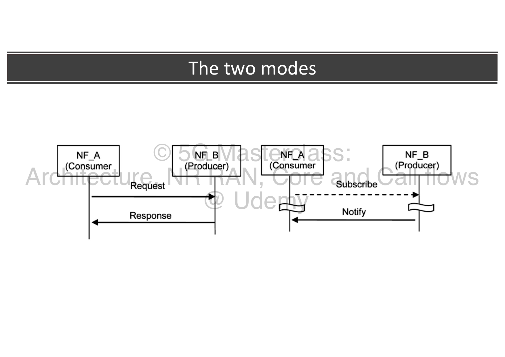

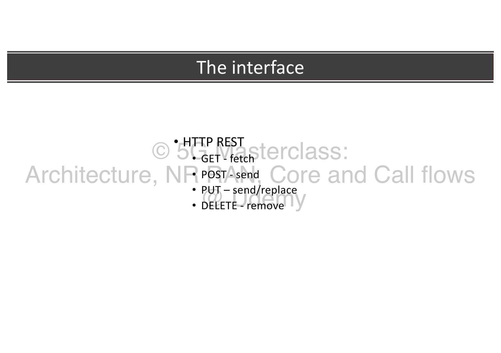

* **Standard Interface:** REST APIs operating over **HTTP/2**.
* **Data Serialization:** Payloads are serialized and sent in **JSON (JavaScript Object Notation)** formats.
* **HTTP/2 Technical Advantages:**
  * **Multiplexing:** Allows sending multiple concurrent requests and responses over a single TCP connection, eliminating head-of-line blocking.
  * **Header Compression (HPACK):** Compresses HTTP headers to drastically reduce over-the-air overhead.
  * **Binary Framing Layer:** Parses requests as binary frames rather than plain text, improving parsing speed and lowering CPU overhead.
* **RESTful Methods Used:**
  * `GET`: Used by a consumer to retrieve/fetch data from a producer.
  * `POST`: Used to send data to trigger an action (such as establishing a session).
  * `PUT`: Used to create, send, or completely replace a resource.
  * `DELETE`: Used to remove/teardown a resource.

---

## 🔍 5. Service Discovery & Registration (The NRF)

In a dynamic, cloud-native SBA, Network Functions are spun up and torn down constantly. To allow NFs to locate each other, 5G introduces the **Network Repository Function (NRF)** as the central directory.

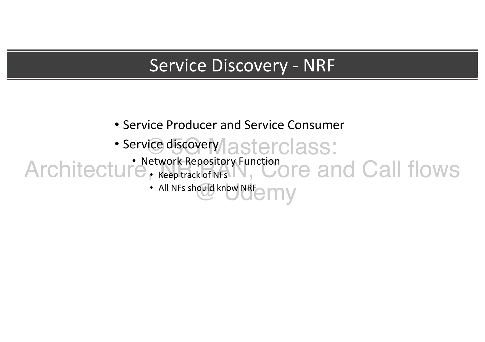

SBA interactions are governed by the **Service Producer** (exposes a service) and **Service Consumer** (requests a service) model, coordinated through the NRF in three distinct stages:

---

### Stage A: Service Registration

When a new NF instance (e.g., a PCF) is deployed, it must declare its presence and capabilities to the network.

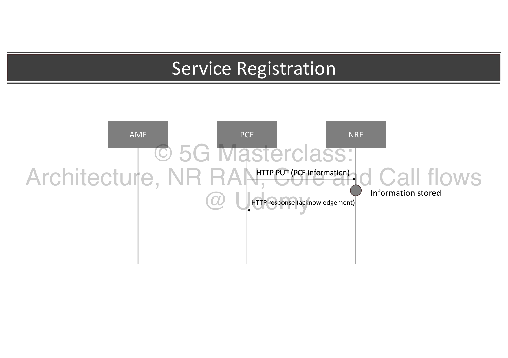

* **The Flow:** The PCF (Service Producer) sends its operational metadata (IP address, supported services, capacity limits) to the central NRF.
* **The Protocol & API Path:** Sent via an `HTTP PUT` request to the NRF path:
  `/nnrf-nfm/v1/nf-instances/{nfInstanceId}`
  Carrying the PCF's **NF Profile** (NF Type, PLMN ID, FQDN, IPv4/IPv6, supported services).
* **The Response:** The NRF registers the PCF and returns an `HTTP Response (201 Created)` confirming registration.

---

### Stage B: Service Discovery

When a Service Consumer (e.g., an AMF) needs to perform a task (e.g., retrieve policy rules for a newly registered UE), it must locate a suitable producer.

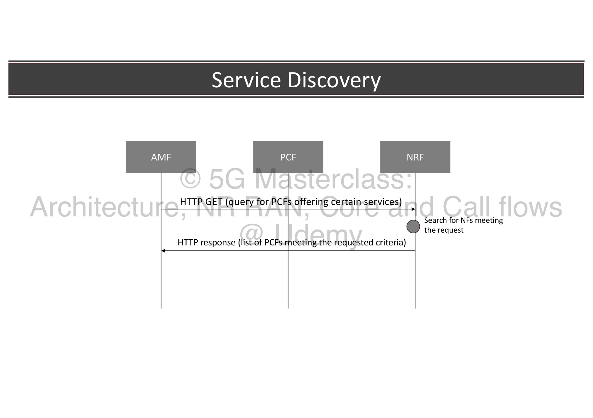

* **The Flow:** The AMF queries the NRF, requesting a list of active PCF instances that support the required policies.
* **The Protocol & API Path:** Sent via an `HTTP GET` query to the NRF discovery path:
  `/nnrf-disc/v1/nf-instances?requester-nf-type=AMF&target-nf-type=PCF&service-names=npcf-am-policy-control`
* **The Response:** The NRF searches its database and returns an `HTTP Response (200 OK)` containing a JSON list of PCFs matching the requested criteria.

---

### Stage C: Service Request

With the producer's coordinates acquired, the consumer communicates directly with the target NF.

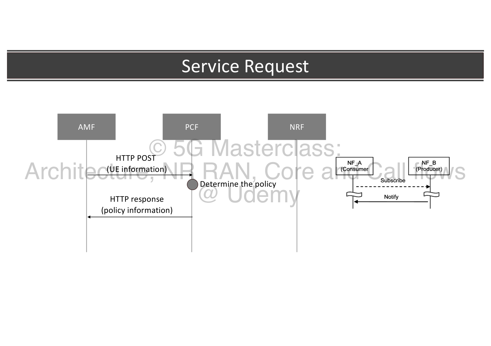

* **The Flow:** The AMF contacts the discovered PCF directly to request policy rules.
* **The Protocol & API Path:** Sent via an `HTTP POST` request to the PCF service path:
  `/npcf-am-policy-control/v1/policies`
  Carrying the UE's subscription profile.
* **The Response:** The PCF processes the logic and returns the `HTTP Response (201 Created)` carrying the authorized policy rules in the JSON body.

---

## 📊 Summary of SBA Interaction Call Flow

The entire NRF-coordinated SBA communication cycle is mapped cleanly in a sequential timeline:

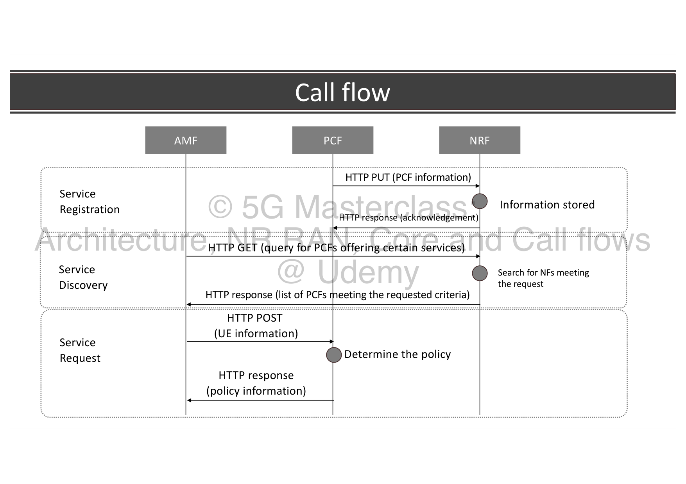

1. **Service Registration:** Producer (PCF) registers capabilities with the NRF using `HTTP PUT`.
2. **Service Discovery:** Consumer (AMF) queries the NRF using `HTTP GET` to locate a suitable producer.
3. **Service Request:** Consumer (AMF) requests policy rules directly from the Producer (PCF) using `HTTP POST`.

---
## 🔗 Related Notes
* **Previous Topic:** [[01. 5G Core Network Identifiers|01. 5G Core Network Identifiers]]
* **Next Topic:** [[03. 5G Access and Mobility Management Function (AMF)|03. 5G Access and Mobility Management Function (AMF)]]
* **Module Index:** [[5G Core Networks - Index|Back to 🧠 Module 4 Index]]
