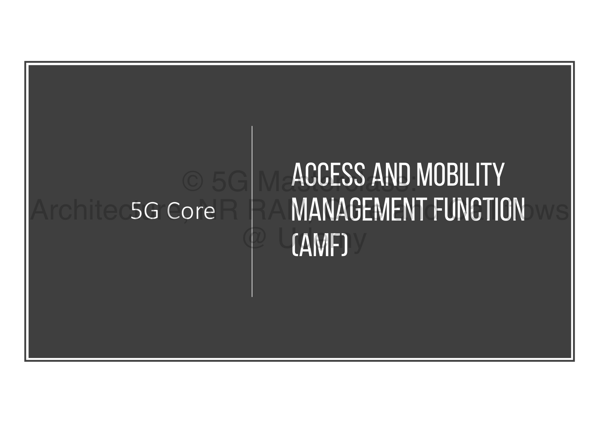
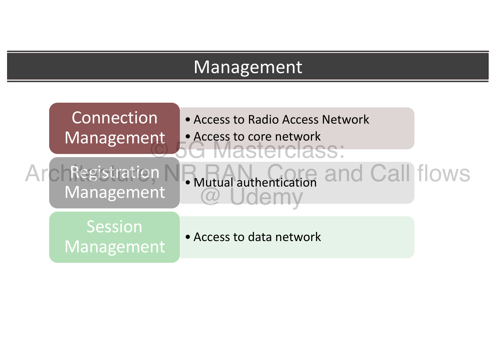
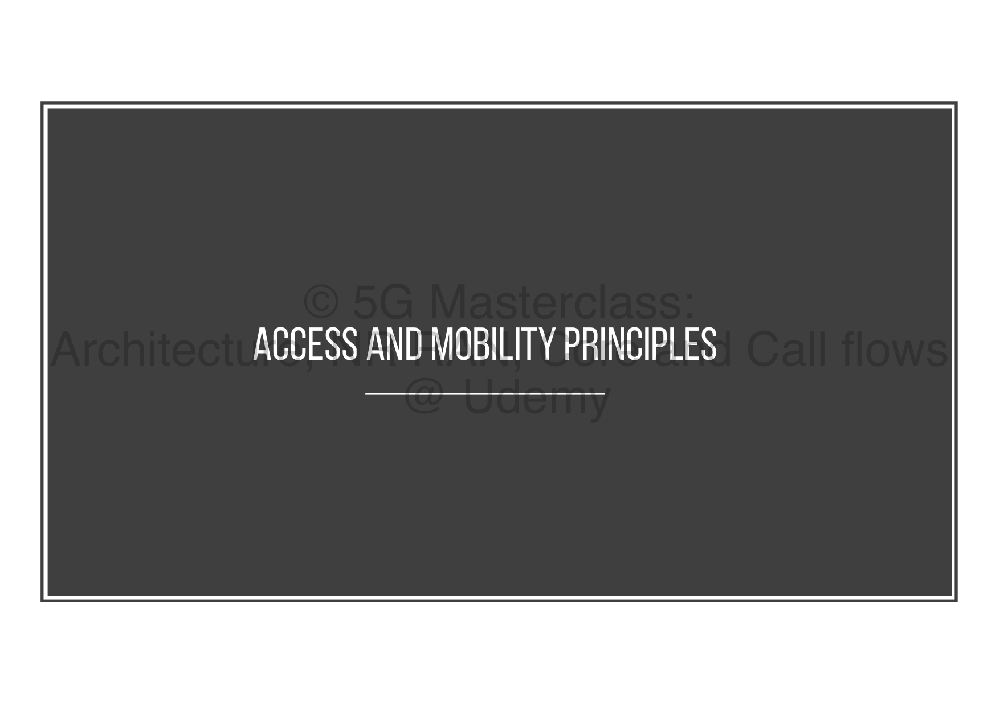
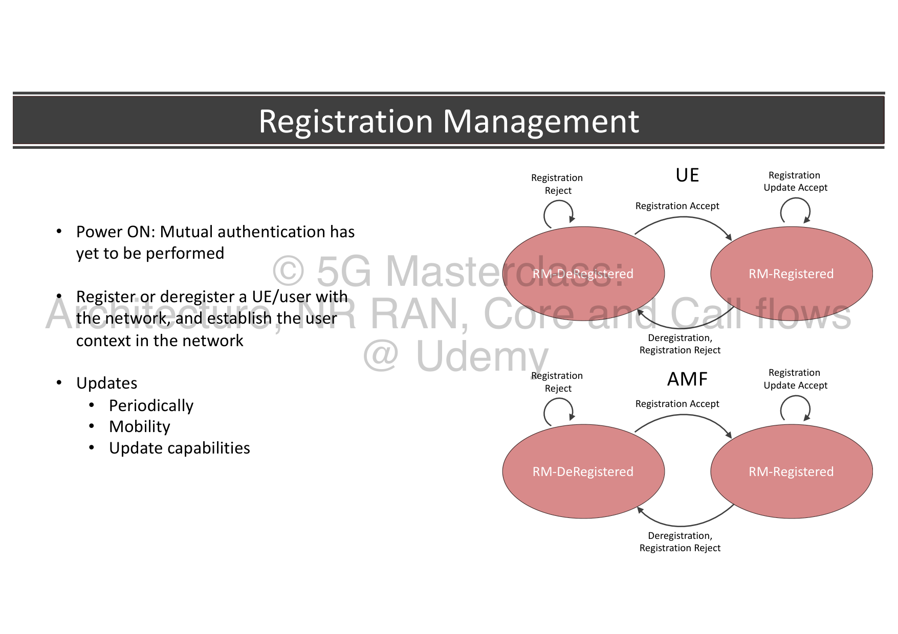
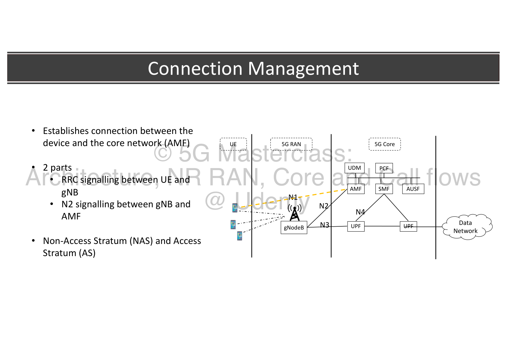
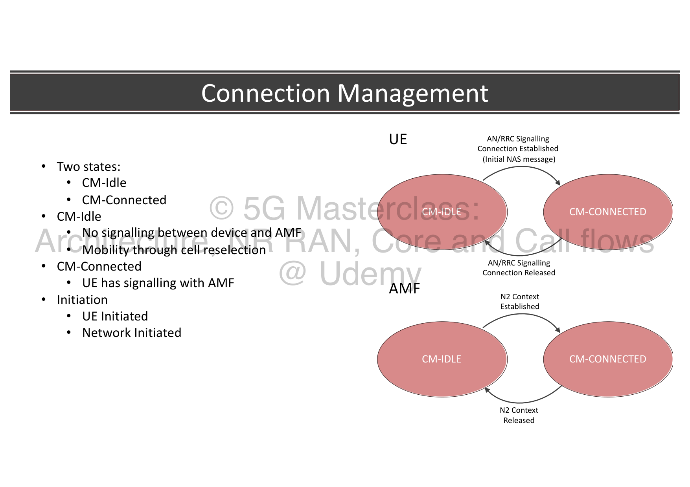
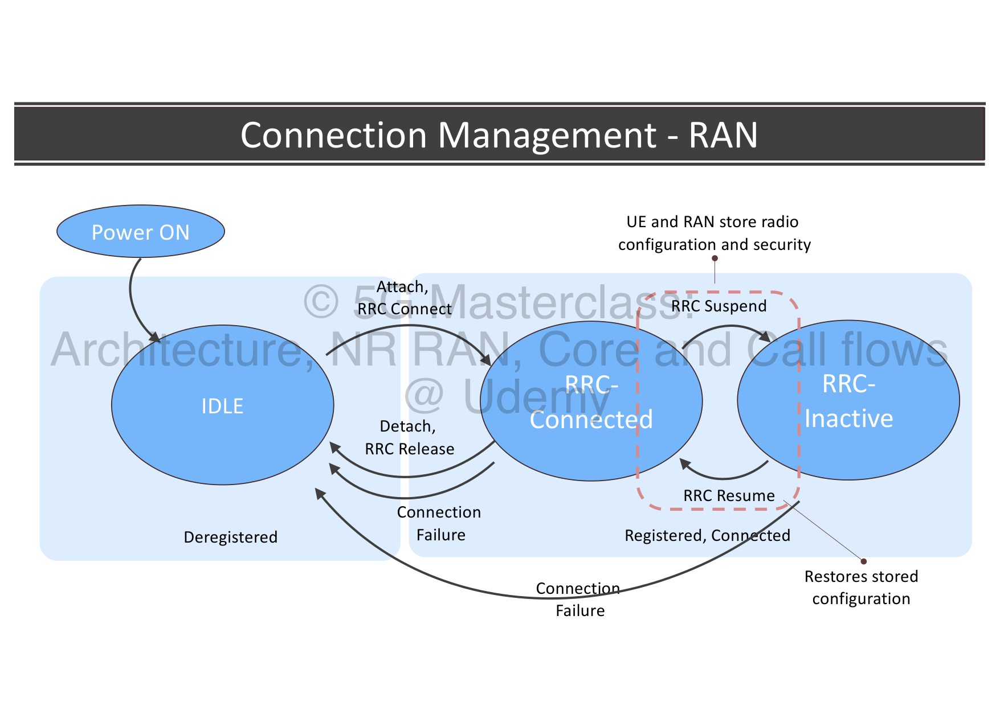
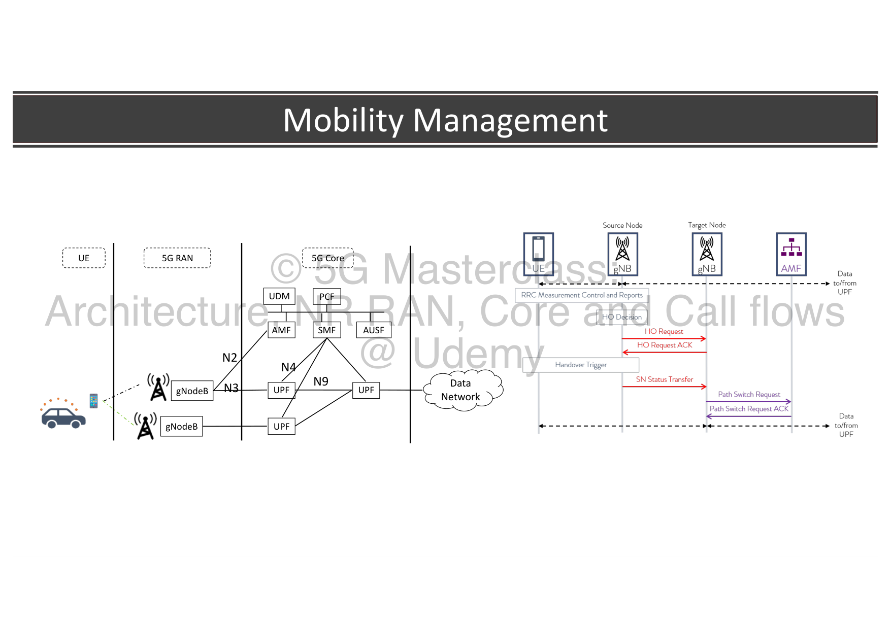
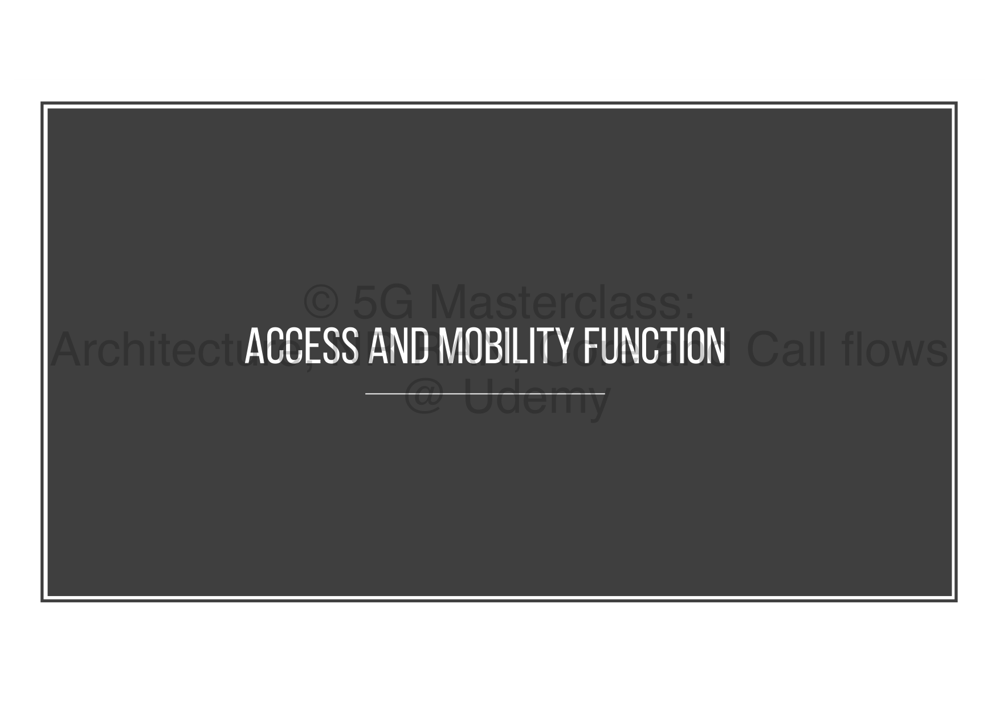
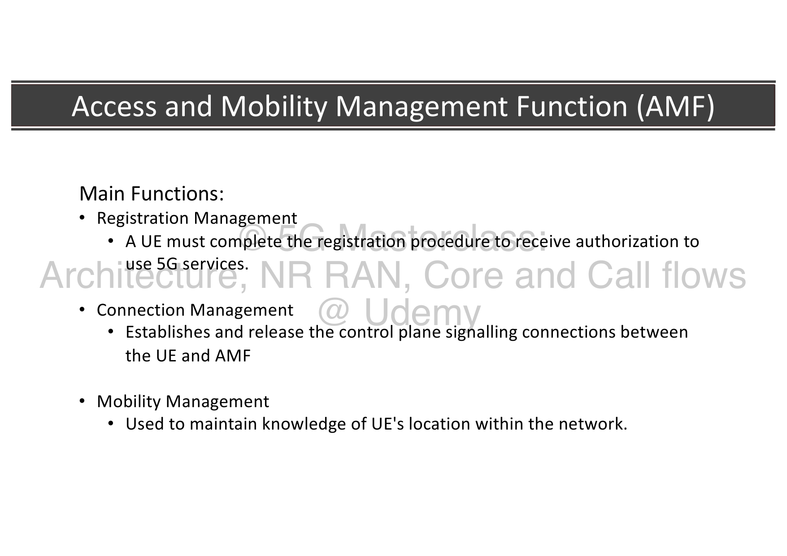

# 03. 5G Access and Mobility Management Function (AMF)

The **Access and Mobility Management Function (AMF)** is the primary gateway for control plane signaling in the 5G Core (5GC). It serves as the single point of contact for the User Equipment (UE) and the Radio Access Network (gNodeB) for all access-related control signaling.

---

## 🗺️ 1. Main Management Pillars

The AMF is responsible for three massive control plane management domains:

1. **Connection Management (CM):** Establishes, monitors, and releases control-plane signaling connections between the UE and the AMF.
2. **Registration Management (RM):** Authorizes device access to the network and maintains subscriber tracking records.
3. **Session Management (SM) Handling:** Serves as the transparent transit postman forwarding session-related NAS messages between the UE and the Session Management Function (SMF) via the N11 interface.
4. **Mutual Authentication:** Orchestrates subscriber security verification by coordinating cryptographic challenges between the UE and the Authentication Server Function (AUSF).

---

## 🔒 2. Registration Management (RM) States & Types

Registration Management governs how a device declares its presence and capabilities to the network, transitioning between two core 3GPP states:

* **RM-DEREGISTERED:**
  * **The Setup:** The UE is powered off or disconnected. No subscriber context exists for this device within the AMF.
  * **UE Behavior:** The UE must initiate a `Registration Request` over-the-air. The AMF intercepts this request and coordinates mutual authentication with the AUSF/UDM.
  * **Transitions:** 
    * If authorized, the AMF sends a **Registration Accept** message, moving the UE to `RM-REGISTERED`.
    * If authentication fails or the subscription is invalid, the AMF sends a **Registration Reject** message, keeping the device in `RM-DEREGISTERED`.
* **RM-REGISTERED:**
  * **The Setup:** The UE is actively authorized and registered. A secure subscriber context (including key sets, profiles, and slice permissions) is saved in both the UE and the AMF.
  * **Four Specific Registration Update Types:**
    1. **Initial Registration:** Triggered on first boot or recovery from long-term power-off.
    2. **Mobility Registration Update:** Triggered when the UE moves out of its assigned Registration Area (containing one or more Tracking Areas).
    3. **Periodic Registration Update:** Triggered periodically by a keep-alive timer to prevent the core network from purging inactive subscriber context.
    4. **Emergency Registration:** Used to access emergency services when no valid subscription exists or the device is barred.

---

## ⚡ 3. Connection Management (CM) States & Connections

Connection Management establishes and releases the control plane signaling paths between the UE and the AMF, transitioning between two core 3GPP states:

The control signaling path is split into **two explicit parts**:
1. **AS Signaling:** The RRC connection over the air between the UE and the gNodeB.
2. **NAS Signaling (N2):** The control plane connection over the wired N2 interface between the gNodeB and the AMF (NG-AP protocol).

---

### CM State Machine Transitions:

* **CM-IDLE:**
  * **The Setup:** The UE has no active signaling path. No over-the-air RRC connection exists, and the N2 context at the gNodeB is released.
  * **Power Consumption:** The UE is in deep sleep mode to conserve battery.
  * **Mobility:** Mapped strictly to **UE-Controlled Mobility** cell reselection based on SIB configurations. The AMF only knows the UE's location down to a broad Tracking Area (TA) level.
  * **Transitions:** An incoming or outgoing event (e.g., UE-initiated uplink data, or network-initiated downlink paging) triggers the establishment of an RRC connection and an **N2 Context Establishment**, moving the UE to `CM-CONNECTED`.
* **CM-CONNECTED:**
  * **The Setup:** Signaling connections are fully active over both the airwaves (RRC) and wired links (N2 context is active).
  * **Mobility:** Mapped strictly to **Network-Controlled Mobility** handovers. The AMF knows the UE's exact location down to the specific serving cell.
  * **Transitions:** If traffic goes quiet for a set period, the gNodeB releases the RRC connection and triggers an **N2 Context Release** toward the AMF, transitioning the UE back to `CM-IDLE`.

---

## 🧱 4. RAN Connection States: RRC vs. CM & RAN-Initiated Paging

The 3-state RRC RAN machine interacts closely with the AMF's Connection Management states:

When the UE enters the new **RRC_INACTIVE** state in the RAN:
* **Core View:** The AMF **retains the UE in the CM-CONNECTED state**. The N2 control link and N3 user-plane tunnel between the gNodeB and the 5G Core remain active. The inactivity is completely hidden from the core network.
* **RAN View:** Over-the-air, the gNodeB sends an `RRC Suspend` command, caching the AS context (security keys and configurations) locally in both the UE and the gNodeB memory.
* **RAN-Initiated Paging (High Value):** If downlink data arrives for an RRC_INACTIVE UE, the UPF forwards it to the gNodeB anchor since the core still sees the device as active.
  * Rather than generating heavy core-level paging, the gNodeB itself triggers **RAN-Initiated Paging** across all cells in the UE's assigned **RAN Notification Area (RNA)**.
  * The UE receives the page, responds with an `RRC Resume Request`, instantly restores its cached context, and resumes traffic, avoiding any signaling exchange with the AMF/Core.

---

## 🏎️ 5. Mobility and Interface Architecture

The AMF acts as the central control plane dispatcher, coordinating mobility and session management via dedicated 3GPP interfaces:

* **N1 Interface:** Carries NAS control signaling directly between the UE and the AMF.
* **N2 Interface:** Connects the gNodeB to the AMF to coordinate RAN-level control plane signaling.
* **N11 Interface:** Connects the AMF to the SMF to relay session management requests.
* **N8 / N12 / N13:** Interfaces the AMF to UDM, AUSF, and database functions to coordinate authentication and subscriber profile loading.

---

## 📊 Summary of AMF Operations

The AMF is the absolute control plane engine of the 5G Core, managing access, timing, and security:

* **Access Control:** Oversees Registration (RM-DEREGISTERED vs. RM-REGISTERED) and Connection (CM-IDLE vs. CM-CONNECTED) state machines.
* **Mobility Management:** Tracks device movement within cell grids and manages paging and active handovers.
* **Transparent Transit:** Relays NAS session requests cleanly to the SMF to set up user data paths.

---
## 🔗 Related Notes
* **Previous Topic:** [[02. 5G Service-Based Architecture (SBA)|02. 5G Service-Based Architecture (SBA)]]
* **Next Topic:** [[04. 5G Session Management Function (SMF)|04. 5G Session Management Function (SMF)]]
* **Module Index:** [[5G Core Networks - Index|Back to 🧠 Module 4 Index]]
