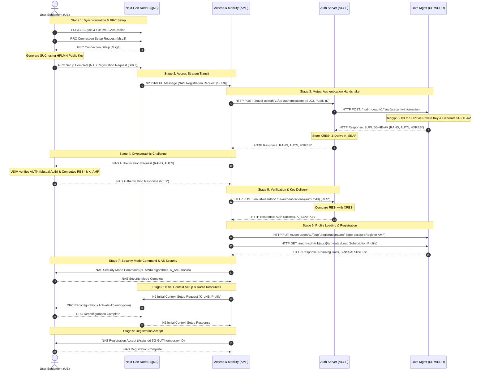

# 01. 5G Registration and Deregistration Call Flows

The **Initial Registration** procedure is the foundational control-plane handshake that a User Equipment (UE) executes to connect to the 5G network. It authorizes the subscriber, activates over-the-air encryption, registers the serving AMF in the database, and assigns a temporary runtime identity.

---

## 🔄 1. Step-by-Step Initial Registration Signaling Flow

When a device powers on, it executes a highly coordinated, multi-node signaling handshake across all key interfaces (**N1, N2, N12, N13, N8, N11**):



---

### Granular Signaling Phase Breakdown:

#### 1. RRC Connection Setup & SUCI Generation
* **RRC Handshake:** The UE syncs with the gNodeB and initiates the RRC connection via `RRC Connection Setup Request`. The gNodeB responds with `RRC Connection Setup`.
* **SUCI Concealment:** The UE USIM extracts the operator's HPLMN Public Key. Using the **ECIES** encryption scheme, it encrypts the permanent MSIN portion of its SUPI to generate the **SUCI (Subscription Concealed Identity)**.
* **NAS Envelope:** The UE embeds the initial **NAS Registration Request (carrying the SUCI)** inside the `RRC Connection Setup Complete` message, forwarding it to the gNodeB.

#### 2. Access Stratum Transit (N2 NG-AP)
* **The Postman Rule:** The gNodeB strips the RRC headers, wraps the raw NAS payload inside an NG-AP N2 envelope (`Initial UE Message`), and forwards it over the wired N2 control interface to the AMF.

#### 3. Mutual Authentication Core Handshake (N12/N13)
* **AUSF Challenge:** The AMF triggers authentication by sending an `HTTP POST` request to the AUSF over N12 (`/nausf-ueauth/v1/ue-authentications`), carrying the SUCI and visited PLMN ID.
* **UDM Decryption:** The AUSF forwards the request to the UDM over N13 (`/nudm-ueau/v1/{suci}/security-information`). The UDM decrypts the SUCI using the HPLMN private key, recovering the plaintext **SUPI**.
* **Vector Generation:** The UDM runs the Milenage/TU3G algorithm using the subscription key ($K$) stored in the UDR, generating the **5G-HE-AV (Authentication Vector)** containing:
  * **RAND:** A random challenge value.
  * **AUTN:** The network authentication token (proves the network is legitimate).
  * **XRES\***: The expected cryptographic response value.
* **Anchor Key Derivation:** The UDM returns the vectors and plaintext SUPI to the AUSF. The AUSF hashes the expected response to create the **HXRES\*** (Hidden Expected Response) and derives the security anchor key **$K_{\text{SEAF}}$**, then forwards the RAND, AUTN, and HXRES\* to the AMF.

#### 4. The Cryptographic Challenge
* **UE Challenge:** The AMF sends the `NAS Authentication Request` carrying the RAND and AUTN to the UE over N1.
* **Mutual Authentication Verification:** The UE USIM runs the Milenage algorithm, validates the network's identity using the AUTN token (preventing rogue cell towers), and calculates its cryptographic response **RES\*** and the security key **$K_{\text{AMF}}$**.
* **UE Response:** The UE sends `NAS Authentication Response (RES*)` back to the AMF.

#### 5. Verification & Profile Loading
* **AUSF Validation:** The AMF forwards the RES\* to the AUSF over N12. The AUSF compares RES\* with its stored XRES\*. If they match (Auth Success), the AUSF delivers the $K_{\text{SEAF}}$ key to the AMF.
* **Serving AMF Registry:** The AMF registers itself as the active serving node in the UDM over N8 using `HTTP PUT` to `/nudm-uecm/v1/{supi}/registrations/amf-3gpp-access`.
* **Profile Loading:** The AMF loads the subscriber's roaming profile, S-NSSAI slice entitlements, and service limits from the UDM over N8 using `HTTP GET` to `/nudm-sdm/v1/{supi}/am-data`.

#### 6. NAS Security & RRC Reconfiguration
* **NAS Security SMC:** The AMF commands the UE to activate control plane encryption and integrity protection via `NAS Security Mode Command` (configuring NEA/NIA algorithms).
* **Initial Context Setup:** The AMF derives the **$K_{\text{gNB}}$** key from the $K_{\text{AMF}}$ and forwards it to the gNodeB inside the N2 `Initial Context Setup Request` message.
* **AS Security:** The gNodeB triggers RRC-level AS security over the air via `RRC Reconfiguration`. The UE activates encryption and responds with `RRC Reconfiguration Complete`.

#### 7. Registration Accept & GUTI Assignment
* **GUTI Delivery:** The AMF compiles the `NAS Registration Accept` message, carrying the dynamically assigned **5G-GUTI** temporary identity, and sends it to the UE.
* **Handshake Complete:** The UE saves the 5G-GUTI and returns `NAS Registration Complete`. The device is now camped and fully authorized to request user data sessions.

---

## 🛑 2. Deregistration Procedures (Context Teardown)

Deregistration terminates active network sessions and context profiles, and can be initiated by the device or the network:

```
[ UE-Initiated Deregistration Flow ]
UE ──(NAS Deregistration Request over N1)──> AMF ──(PDU Release)──> SMF ──(PFCP Session Delete)──> UPF
                                              │
                                     (N2 Context Release)
                                              │
                                              ▼
                                   gNB ──(RRC Release)──> UE

```

### A. UE-Initiated Deregistration (e.g., Power Off)
1. **Deregistration Request:** The UE sends a `NAS Deregistration Request` to the AMF over the N1 interface, specifying whether it is a normal power-off or an attach-switch.
2. **User Plane Release:** The AMF contacts the SMF over N11 to release all active PDU Sessions. The SMF contacts the UPF over N4 to delete active PFCP sessions and release dynamic IP pools.
3. **Signaling Connection Release:** The AMF sends the `N2 UE Context Release Command` to the gNodeB. The gNodeB sends an `RRC Release` over-the-air to the UE, purges the stored context, and returns `N2 UE Context Release Complete` to the AMF, closing all paths.

### B. Network-Initiated Deregistration (e.g., Subscription Expiry / Billing Failure)
1. **Deregistration Notification:** The UDM detects a subscription cancellation or billing block and triggers an `HTTP POST` deregistration notification to the serving AMF over N8 (`/nudm-sdm/v1/{supi}/dereg-notify`).
2. **UE Notification:** The AMF compiles and sends a `NAS Deregistration Request` to the UE over N1, forcing the device off the network.
3. **Acknowledgment:** The UE returns a `NAS Deregistration Accept` acknowledgment.
4. **Context Purging:** The AMF coordinates session teardowns with the SMF/UPF, and commands the gNodeB to execute RRC release, purging all subscriber traces from active memory.

---
## 🔗 Related Notes
* **Next Topic:** [[02. 5G PDU Session Establishment Call Flow|02. 5G PDU Session Establishment Call Flow]]
* **Module Index:** [[5G Call Flows - Index|Back to 📲 Module 5 Index]]
