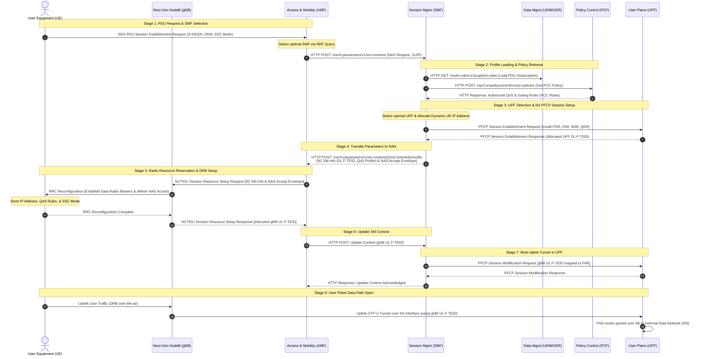

# 02. 5G PDU Session Establishment Call Flow

Once a device has registered with the network, it must establish a user-plane data path to transmit application packets. This is achieved by creating a **PDU (Packet Data Unit) Session**. The establishment flow coordinates control plane messaging to dynamically provision IP addresses, configure radio resources, and bind wired data tunnels.

---

## 🔄 1. Step-by-Step PDU Session Establishment Signaling Flow

PDU Session Establishment is a highly coordinated procedure involving the UE, RAN, and multiple core Network Functions communicating over standard interfaces (**N1, N2, N3, N4, N11, N7, N10, N6**):

---

### Granular Signaling Phase Breakdown:

#### 1. PDU Request & SMF Selection
* **UE PDU Request:** The UE compiles the `NAS PDU Session Establishment Request` message, carrying the dynamic PDU Session ID, the S-NSSAI slice identifier, the Data Network Name (DNN), and the requested SSC Mode, and transmits it over N1.
* **SMF Dispatching:** The AMF intercepts the request. It queries the NRF to select the optimal **SMF (Session Management Function)** based on the UE's location, target slice, and DNN, then forwards the NAS request to the SMF over N11 using an `HTTP POST` context creation query (`/nsmf-pdusession/v1/sm-contexts`).

#### 2. Profile Loading & Policy Retrieval
* **UDM Profile Check:** The SMF retrieves the subscriber's session-specific profiles and slice authorizations from the UDM over N10 using `HTTP GET` to `/nudm-sdm/v1/{supi}/sm-data`.
* **PCF QoS Rules:** The SMF contacts the PCF over N7 using `HTTP POST` to `/npcf-smpolicycontrol/v1/sm-policies` to retrieve authorized **PCC (Policy and Charging Control) Rules**, which define dynamic bandwidth caps (MBR, GBR) and gating controls.

#### 3. UPF Selection & N4 PFCP Session Setup
* **UPF Anchor Selection:** The SMF selects the optimal **UPF (User Plane Function)** instance to serve as the PDU Session Anchor (PSA) and dynamically allocates the UE's IPv4/IPv6 address.
* **PFCP Rule Installation:** The SMF contacts the UPF over N4, sending a `PFCP Session Establishment Request` to install explicit lookup and routing rules:
  * **PDR (Packet Detection Rules):** Teaches the UPF how to match the UE's dynamic IP address and incoming GTP-U headers.
  * **FAR (Forwarding Action Rules):** Configures actions (forward, drop, duplicate, buffer).
  * **QER (QoS Enforcement Rules):** Configures bit rates and writes the QoS Flow Identifier (QFI) tag.
* **DL F-TEID Allocation:** The UPF allocates its own Downlink IP and **TEID (Tunnel Endpoint Identifier)** (called the **UPF DL F-TEID**), returning it to the SMF inside the `PFCP Session Response`.

#### 4. Parameter Delivery to RAN & DRB Setup
* **N2 Parameter Delivery:** The SMF packages the UPF DL F-TEID and QoS Profiles into the N2 SM Information container. It bundles this container with the over-the-air `NAS PDU Session Establishment Accept` envelope and sends it to the AMF over N11.
* **gNodeB Setup:** The AMF forwards the N2 SM Information and NAS accept envelope to the gNodeB inside the N2 `PDU Session Resource Setup Request`.
* **DRB Establishment:** The gNodeB decodes the parameters. It triggers over-the-air **Data Radio Bearers (DRBs)** reservation via `RRC Reconfiguration`. The UE parses the NAS envelope, stores its allocated IP address, binds the QoS Rules, and returns `RRC Reconfiguration Complete`.

#### 5. Binding the Uplink Tunnel
* **gNB UL F-TEID Allocation:** The gNodeB allocates its own Uplink IP and TEID for user plane traffic (called the **gNB UL F-TEID**) and returns it to the AMF inside the N2 `PDU Session Resource Setup Response`.
* **SM Context Update:** The AMF forwards the gNB UL F-TEID to the SMF over N11.
* **FAR Header Modification:** The SMF contacts the UPF over N4 via a `PFCP Session Modification Request`, updating the FAR rule with the **gNB UL F-TEID** under "Outer Header Creation."
* **Uplink Open:** The UPF now knows exactly where to route downlink packets in the RAN. The user plane GTP-U tunnel is fully established in both directions.

#### 6. User Plane Data Open
* The end-to-end data pathway is open:
  * **Over the air:** UE ➔ gNodeB via Data Radio Bearers (DRB).
  * **Core wired link:** gNodeB ➔ UPF via N3 GTP-U tunnels (using gNB UL F-TEID for uplink, and UPF DL F-TEID for downlink).
  * **External exit:** UPF ➔ Internet/IMS via the N6 interface.

---
## 🔗 Related Notes
* **Previous Topic:** [[01. 5G Registration and Deregistration Call Flows|01. 5G Registration and Deregistration Call Flows]]
* **Next Topic:** [[01. 5G Evolution and Future Trends|01. 5G Evolution and Future Trends]]
* **Module Index:** [[5G Call Flows - Index|Back to 📲 Module 5 Index]]
